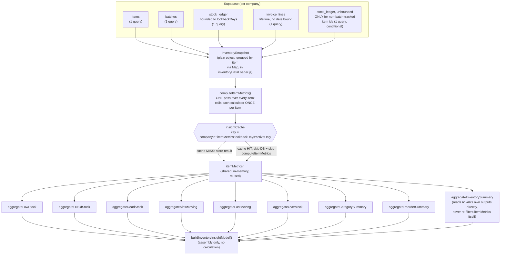
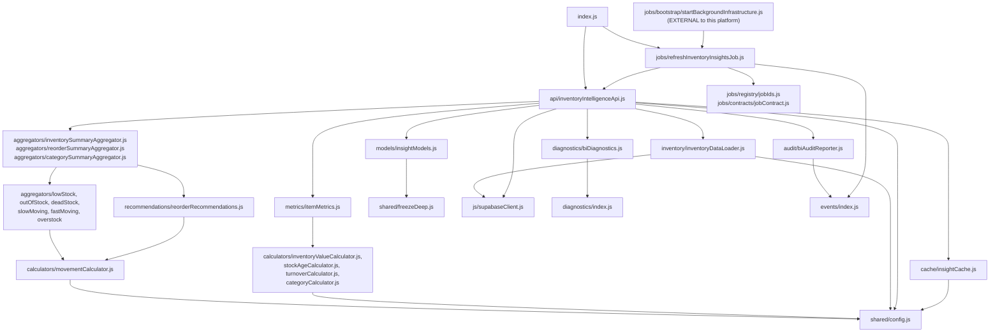

# Inventory Intelligence Platform — Architecture Reference

This is the permanent architectural reference for `js/services/businessIntelligence/`,
written for whoever maintains or extends this module next. It describes the system **as
it stands today**, organized by concept, not by milestone. It does not repeat the
rationale already recorded in the milestone docs — consult those when you need the "why"
behind a specific decision:

- `docs/milestones/milestone-12a-inventory-intelligence.md` — the milestone brief and
  design rationale
- `docs/reports/milestone-12a-completion.md` — what was actually built and verified

## 1. What this platform is

The Inventory Intelligence Platform is ApnaBill's **read-only Business Intelligence
layer** over the existing, already-complete Inventory/Items/Purchases/Sales modules. It
converts inventory data the ERP already stores into reusable insights — inventory value,
turnover, low/out-of-stock, dead/slow/fast-moving classification, category performance,
reorder recommendations. It is **not**:

- a new inventory module — Inventory, Items, Purchases, and Sales already exist and are
  untouched by this platform (confirmed by grep: no file under `js/items.js`,
  `js/purchases.js`, `js/sales.js`, or `schema.sql` was modified for this milestone);
- artificial intelligence, machine learning, or any predictive/statistical model —
  every number here is a deterministic calculation over data that already exists;
- a workflow engine — it never creates a purchase order, never adjusts stock, and never
  automates purchasing. Every recommendation is a suggestion a human (or a future
  Purchase Intelligence milestone) decides what to do with.

It lives entirely under `js/services/businessIntelligence/`, is a sibling of
`js/services/events/`, `js/services/diagnostics/`, `js/services/jobs/`,
`js/services/audit/`, and `js/services/extensions/`, and depends on the public barrels of
all five of those (the same shape `js/services/extensions/` already established as "the
one platform that depends on all the others; none of them import anything back from it").

## 2. The layering — exactly the brief's own diagram

```
ERP (items, batches, stock_ledger, invoice_lines -- read only)
  ↓
Metrics            (metrics/itemMetrics.js)
  ↓
Calculators        (calculators/*.js)
  ↓
Aggregators        (aggregators/*.js)
  ↓
Insight Models     (models/insightModels.js)
  ↓
Business Intelligence Services   (api/inventoryIntelligenceApi.js)
  ↓
Dashboard / Reports / Extensions   (not built by this milestone)
```

A future Dashboard/Report/Extension imports **only** from
`js/services/businessIntelligence/index.js` (or, most commonly, calls a method on the
shared `inventoryIntelligence` instance it exports) — it never reaches into
`calculators/`, `aggregators/`, or `metrics/` directly, and it never performs a
calculation itself. This is the platform's own permanent rule, mirrored from the milestone
brief: **the Dashboard must never contain calculations.**

## 3. Module map and dependency direction

```
shared/                    <- no internal deps (self-contained; deliberately not
  freezeDeep.js, now.js,       imported from events/shared/, diagnostics/shared/,
  config.js                   jobs/shared/, or audit/shared/ -- same precedent
                                every prior platform's own copy already documents).
                                config.js is the single source of truth for every
                                tunable numeric constant this platform has (§18).
  ↑
inventory/                  <- js/supabaseClient.js (supa, getActiveCompanyId) --
  inventoryDataLoader.js        the ONLY file in this platform that touches Supabase
  ↑
metrics/                    <- calculators/ (invoked once per item, per calculator)
  itemMetrics.js
  ↑
calculators/                <- no internal deps besides each other where noted
  inventoryValueCalculator.js
  stockAgeCalculator.js
  turnoverCalculator.js
  movementCalculator.js
  categoryCalculator.js
  ↑
aggregators/                <- calculators/ (movement predicates only -- never
  lowStockAggregator.js         re-derives a predicate, always imports it)
  outOfStockAggregator.js
  deadStockAggregator.js
  slowMovingAggregator.js
  fastMovingAggregator.js
  overstockAggregator.js
  inventorySummaryAggregator.js
  categorySummaryAggregator.js
  reorderSummaryAggregator.js   <- recommendations/reorderRecommendations.js
  ↑
recommendations/            <- calculators/movementCalculator.js
  reorderRecommendations.js
  ↑
models/                     <- shared/freezeDeep.js only (assembles, never calculates)
  insightModels.js
  ↑
diagnostics/                <- diagnostics/ (createStructuredLogger/
  biDiagnostics.js               createExecutionTimeline/createMetricsRecorder)
cache/                      <- no internal deps
  insightCache.js
audit/                      <- events/ (eventBus, EVENT_TYPES) -- the only file in
  biAuditReporter.js            this platform that publishes a Domain Event
extensions/                 <- no internal deps (discovery helpers only)
  capabilityNames.js
  ↑
api/                        <- inventory/, metrics/, calculators/ (via metrics),
  inventoryIntelligenceApi.js    aggregators/, recommendations/ (via aggregators),
                                 models/, diagnostics/, cache/, audit/ -- the
                                 composition root; the ONLY file that wires
                                 everything else together
  ↑
jobs/                       <- events/ (EVENT_TYPES), jobs/registry+contracts
  refreshInventoryInsightsJob.js  (direct subfolder imports, NOT jobs/index.js --
                                    see that file's own header comment for why),
                                    cache/, api/
  ↑
index.js                    <- re-exports everything above
```

Every arrow points from a more specific layer to a more generic one below it, the same
convention every prior platform's own architecture reference documents.

## 4. Public API (`js/services/businessIntelligence/index.js`)

```js
import { inventoryIntelligence, createInventoryIntelligenceApi } from '<path>/services/businessIntelligence/index.js';
```

| Export | Kind | Purpose |
|---|---|---|
| `inventoryIntelligence` | instance | The one shared, application-wide API, wired to the real Supabase-backed loader, shared cache, and shared diagnostics. Real callers use this. |
| `createInventoryIntelligenceApi({ loadSnapshot?, cache?, diagnostics?, recordAudit?, resolveActiveCompanyId? })` | factory | An isolated instance — for tests, or a deliberately separate instance. Every dependency is injectable, which is how this platform's own test suite exercises the whole composition root with zero real Supabase calls. |

### `inventoryIntelligence`'s methods

```js
await inventoryIntelligence.getInventorySummary(opts);          // -> full InventoryInsight model (§7)
await inventoryIntelligence.getInventoryValue(opts);             // -> InventoryValue model
await inventoryIntelligence.getLowStockItems(opts);              // -> item metric[]
await inventoryIntelligence.getOutOfStockItems(opts);            // -> item metric[]
await inventoryIntelligence.getDeadStock(opts);                  // -> item metric[]
await inventoryIntelligence.getSlowMovingItems(opts);            // -> item metric[]
await inventoryIntelligence.getFastMovingItems(opts);            // -> item metric[]
await inventoryIntelligence.getOverstockItems(opts);             // -> item metric[]
await inventoryIntelligence.getCategoryPerformance(opts);        // -> category summary row[]
await inventoryIntelligence.getInventoryTurnover(opts);          // -> number|null (company-wide, annualized)
await inventoryIntelligence.getReorderRecommendations(opts);     // -> { recommendations, urgentCount, ... }
await inventoryIntelligence.generateInventoryInsightReport(opts); // -> InventoryInsight model, AND records an audit entry (§9)
```

`opts` is always `{ companyId?, lookbackDays?, activeOnly?, useCache?, ...movement
threshold overrides }` — every field optional. `companyId` defaults to
`getActiveCompanyId()`; `lookbackDays` defaults to 365; `useCache` defaults to `true`.

## 5. One inventory scan, many insights — performance flow

`inventory/inventoryDataLoader.js`'s `loadInventorySnapshot()` is the **only** place this
platform queries Supabase. It runs exactly four company-scoped queries — `items`,
`batches`, `stock_ledger` (bounded to `lookbackDays`), `invoice_lines` — no matter how
many of the getX() functions above are called, and a fifth, narrowly-scoped query only
for items that are stock-tracked but not batch-tracked (§6). `api/inventoryIntelligenceApi.js`
caches the resulting per-item metrics (`metrics/itemMetrics.js`'s `computeItemMetrics()`
output) for `DEFAULT_CACHE_TTL_MS` (5 minutes, `shared/config.js`, §18) per
`{companyId, lookbackDays, activeOnly}` combination (`cache/insightCache.js`) — every
aggregator called within that window reads the same in-memory array; none of them
re-query the database or rescan raw rows itself.

Exactly what is scanned, and exactly how many times, per call:



**The reuse guarantee, concretely:** calling `getInventorySummary()`,
`getLowStockItems()`, `getDeadStock()`, `getCategoryPerformance()`, and
`getReorderRecommendations()` back-to-back for the same company performs the Supabase
scan and `computeItemMetrics()` pass **once**, not five times — the second through fifth
calls hit `insightCache` and reuse the same `itemMetrics[]` array. This is exercised
directly by `businessIntelligence.test.html`'s api-layer block ("second call with
identical opts is served from cache — loader not re-invoked").

`aggregateInventorySummary()` (§ above) is itself a second-order reuse example: it does
not re-filter `itemMetrics` — it calls the six single-purpose aggregators
(`aggregateLowStock`, `aggregateOutOfStock`, `aggregateDeadStock`, `aggregateSlowMoving`,
`aggregateFastMoving`, `aggregateOverstock`) and only counts their results, so the
movement predicates in `calculators/movementCalculator.js` are evaluated exactly once per
item per aggregator, never duplicated between a specific `getX()` call and the summary.

## 6. Known, disclosed data-model limitations

The database schema is frozen — this milestone reads it as-is, and where the schema
doesn't cleanly support a requested metric, the limitation is disclosed here rather than
worked around with a schema change:

- **No "category" column exists on `items`.** `calculators/categoryCalculator.js` uses
  `hsn_sac` (the GST tax-classification code every item already carries) as a category
  proxy — items sharing an HSN/SAC code are, in Indian retail practice, the same class of
  goods. Items with a blank/null `hsn_sac` group under `"Uncategorized"`.
- **No reservation/sales-order concept exists.** `reservedStock` is always `0` and
  `availableStock` always equals `currentStock` — there is no table anywhere that holds a
  "committed but not yet shipped" quantity.
- **Non-batch-tracked items** (`items.track_batches = false`) never get a `batches` row —
  `batches.qty_on_hand` (the authoritative running balance for batch-tracked items) does
  not exist for them. `inventory/inventoryDataLoader.js` runs one additional, narrowly-scoped,
  unbounded `stock_ledger` query — filtered to only those item ids — to compute their
  current stock instead (still "one query", not one per item).
- **`stock_ledger`'s `unit_cost` on a `'sale'` row is `null` for non-batch-tracked
  items** (confirmed by reading `sale_rpc.sql`'s own non-batch branch) — COGS, and
  therefore turnover ratio, cannot be computed for these items from this data alone; a
  `null` contributes `0` to COGS rather than being estimated. This understates turnover
  for non-batch-tracked items specifically — a real, disclosed limitation of the source
  data, not a calculation bug.
- **`stock_ledger` is read within a `lookbackDays` window** (default
  `DEFAULT_LOOKBACK_DAYS` = 365, `shared/config.js`, §18), not unbounded — an item with
  zero ledger activity inside that window still correctly
  reports `daysSinceLastSale: null` (which IS the dead-stock signal), it just cannot
  report an exact "last sold 400 days ago" date beyond the window.
- **Average Selling Price is a lifetime average**, not windowed — `invoice_lines` carries
  no date column of its own, and this milestone does not join it against `invoices` to
  keep the loader at "one query per table."
- **Average Cost is the current stock's cost basis** (qty-weighted `batches.cost_price`),
  not a historical average purchase price — that would require scanning `purchase_lines`'
  own dated history, out of scope for this metric.

## 7. Insight Models

`models/insightModels.js` assembles already-computed pieces into one deep-frozen object
— it performs no calculation itself. The full model, from `getInventorySummary()` /
`generateInventoryInsightReport()`:

```
companyId, generatedAt, lookbackDays,
inventoryValue: { totalInventoryValue, avgInventoryValuePerItem, trackedItemCount, totalStockQty },
stockTurnover:  { overallTurnoverRatio, totalCogsInWindow, lookbackDays },
summary,              -- aggregators/inventorySummaryAggregator.js's full output
lowStock, outOfStock, deadStock, slowMoving, fastMoving, overstock,  -- item metric arrays
categoryPerformance,  -- aggregators/categorySummaryAggregator.js's rows
recommendations       -- aggregators/reorderSummaryAggregator.js's output
```

## 8. Movement classification — one decision point, not duplicated per aggregator

`calculators/movementCalculator.js` is the single source of truth for
Low/Out-of-Stock/Dead/Slow/Fast/Overstock predicates (`isLowStock`, `isOutOfStock`,
`isDeadStock`, `isSlowMoving`, `isFastMoving`, `isOverstock`) — every aggregator imports
these, none re-derive the logic. Dead stock takes precedence: an item with no recent sale
is never also counted as slow-moving or overstocked, even though its turnover ratio and
days-of-cover would otherwise qualify — a dead item is a more severe signal than a merely
slow one. All thresholds (`MOVEMENT_DEFAULTS`) are overridable per call, never hardcoded
into an aggregator.

## 9. Diagnostics, caching, and audit — reused, not rebuilt

- **Diagnostics** (`diagnostics/biDiagnostics.js`): fresh instances of
  `diagnostics/`'s own `createStructuredLogger`/`createExecutionTimeline`/
  `createMetricsRecorder` factories — the same reuse pattern the Job Engine (11D) and
  Audit Platform (11E) already established. This platform never subscribes to the Event
  Bus and never starts the shared `diagnosticsObserver` — it is called directly, not
  triggered by events. Every calculation records execution time, items analyzed, and any
  warnings via one `timeline.time()`-style wrapper; cache hits/misses are logged and
  counted separately.
- **Caching** (`cache/insightCache.js`): a plain, in-memory, per-`{companyId, cacheKey}`
  TTL cache — not a new scheduler, just the store a scheduled job (§10) keeps warm. Full
  scope/invalidation/ownership/lifecycle design: §15.
- **Audit** (`audit/biAuditReporter.js`): this platform is read-only and does **not**
  audit every query — only `generateInventoryInsightReport()` (covering an on-demand
  report, a dashboard export, or the scheduled job in §10, distinguished by its
  `reportType` argument) calls `recordInventoryInsightGenerated()`, which publishes a real
  Domain Event (`EVENT_TYPES.INVENTORY_INSIGHT_GENERATED`, added to
  `events/registry/eventTypes.js` via that file's own documented "add one entry" extension
  mechanism, and to `audit/registry/auditRegistry.js` the same way) and lets the
  already-existing Audit Platform observe it like any other event. This file never writes
  an audit record itself and never starts `auditSubscriber`.

## 10. Background Jobs — reused, not rebuilt

`jobs/refreshInventoryInsightsJob.js` registers **one** job
(`JOB_IDS.REFRESH_INVENTORY_INSIGHTS`, added to `jobs/registry/jobIds.js`) with the
existing Job Engine, via `jobs/bootstrap/startBackgroundInfrastructure.js`'s own
documented extension point. Triggered by `StockAdjusted`, `PurchaseCreated`,
`SaleCreated`, and `ItemCreated` — the four events that can change what an inventory
insight would say. On trigger: invalidates the affected company's cached summary
(`insightCache.invalidateCompany`), recomputes and re-caches it via
`generateInventoryInsightReport({ reportType: 'scheduled' })` (which also records the
audit entry per §9). No new scheduler was built — this is the exact "if expensive
calculations exist, cache them using scheduled jobs... do NOT create another scheduler"
instruction this milestone was given.

## 11. Extension points

`extensions/capabilityNames.js` names three capability strings a future extension may
declare in its own `createExtensionDefinition({ capabilities: [...] })`, plus read-only
discovery helpers over the existing Capability Registry (11F) — the same "dumb,
discovery-only" pattern that registry already documents:

```
BI_CAPABILITIES.INVENTORY_INSIGHT_PROVIDER  -- contributes additional inventory insights/facts
BI_CAPABILITIES.INVENTORY_METRIC_PROVIDER   -- contributes an additional per-item metric
BI_CAPABILITIES.DASHBOARD_CARD_PROVIDER     -- contributes a renderable card for a future Dashboard
```

`getInventoryInsightProviders(extensionRuntime)` /
`getInventoryMetricProviders(extensionRuntime)` /
`getDashboardCardProviders(extensionRuntime)` each wrap
`extensionRuntime.capabilityRegistry.getProviders(name)`, returning `[]` (never throwing)
when no runtime is supplied. This module does not modify
`js/services/extensions/` itself. How a future extension actually participates: declare
the capability, subscribe to whatever Domain Events it needs via its own
`ExtensionContext`, and expose its own well-known function a future Dashboard looks up by
extension id after calling one of the discovery helpers above — the same "a consumer
decides what to do with however many providers exist" model the Capability Registry
already uses for every other capability name.

## 12. Error handling

Every layer is a pure function except `inventory/inventoryDataLoader.js` (I/O) and
`jobs/refreshInventoryInsightsJob.js` (runs inside the Job Engine's own
`executeJob()`, which never rethrows — see `docs/job-engine-architecture.md` §9). A
calculator/aggregator/model given well-formed input never throws; `api/inventoryIntelligenceApi.js`
throws only for a genuine caller error (no active company resolvable). Nothing in this
platform ever calls `eventBus.publish()` for a business-mutating fact, only for the one
disclosed audit event in §9.

## 13. Current call sites

Registered, but not yet consumed anywhere in the real UI — this milestone builds the
Business Intelligence *services* layer only, explicitly not a Dashboard (per the
milestone brief: "Do NOT build Dashboard UI"). `jobs/refreshInventoryInsightsJob.js` **is**
live (registered in `startBackgroundInfrastructure()`, which every real page's own
`boot()` already calls per 11D) — it silently keeps the cache warm; nothing in the UI
reads its output yet.

## 14. How to extend this platform

**Add a new metric**: add it to `metrics/itemMetrics.js`'s returned object, backed by a
new or existing calculator. Every aggregator that iterates `itemMetrics` picks it up for
free if it reads the field; nothing about `inventory/inventoryDataLoader.js` needs to
change unless the metric needs a column not already loaded.

**Add a new aggregator**: add a new file under `aggregators/`, importing only from
`calculators/` (never re-deriving a predicate), and wire it into
`api/inventoryIntelligenceApi.js` as a new `getX()` function plus re-export it from
`index.js`.

**Add a new capability an extension can provide**: add a new key to
`extensions/capabilityNames.js`'s `BI_CAPABILITIES` and a matching discovery helper —
nothing under `js/services/extensions/` itself needs to change.

**Milestone 12B (Purchase Intelligence) and beyond**: not started by this milestone. See
§19 below and `docs/reports/milestone-12a-completion.md` §"Readiness for Milestone 12B"
for what is already reusable (the diagnostics/cache/audit/extension wiring patterns, the
`createXApi({ loadSnapshot, cache, diagnostics, recordAudit })` dependency-injection
shape) and what a Purchase Intelligence milestone would need to build fresh (its own data
loader over `purchases`/`purchase_lines`, its own metrics/calculators/aggregators).

## 15. Cache design — scope, invalidation, ownership, lifecycle

`cache/insightCache.js`'s `createInsightCache({ ttlMs })` is a small, dependency-free,
in-memory memoization store. Four properties fully describe it:

**Scope.** One cache instance holds entries for **every** company the running page
touches, but each entry is keyed by `${companyId}::${cacheKey}` — never just `cacheKey`.
`cacheKey` itself is built by the API layer as `` `itemMetrics:${lookbackDays}:${activeOnly}` ``,
so two calls for the same company with different `lookbackDays` or `activeOnly` never
collide or share a stale entry. What is cached is exactly one thing: the
`{ companyId, generatedAt, lookbackDays, itemMetrics }` result of
`getItemMetricsSnapshot()` (the "one scan" step, §5) — never a fully-built
`InventoryInsightModel`, and never a raw Supabase response. Every `getX()` re-derives its
own aggregation from the cached `itemMetrics[]` on every call; only the expensive
scan-and-compute step is memoized.

**Invalidation.** Two independent mechanisms, never a third:
1. **Time-based (TTL)**: `get()` checks `Date.now() > entry.expiresAt` lazily, on read —
   there is no background timer sweeping the store. An expired entry is deleted the next
   time it's looked up and treated identically to a cache miss.
2. **Event-driven (explicit)**: `jobs/refreshInventoryInsightsJob.js` calls
   `insightCache.invalidateCompany(companyId)` whenever `StockAdjusted`, `PurchaseCreated`,
   `SaleCreated`, or `ItemCreated` fires for that company (§10) — deleting every entry
   whose key starts with `${companyId}::`, regardless of `cacheKey` suffix (so all
   `lookbackDays`/`activeOnly` variants for that company are invalidated together, not
   just the one combination the job happens to recompute next). `useCache: false` on any
   `getX()` call is a third, per-call bypass (skip read AND skip write) — not an
   invalidation, since it never deletes an existing entry.

**Memory ownership.** The cache owns exactly one JS `Map` in its own closure — no
external code ever holds a reference to an entry directly; every read goes through `get()`,
every write through `set()`. `api/inventoryIntelligenceApi.js` does not own the cache; it
receives one via dependency injection (`createInventoryIntelligenceApi({ cache })`,
defaulting to the shared `insightCache` singleton) and never reaches into its internal
`Map`. Nothing in this platform ever caches a DOM node, a Supabase client, or any
UI-owned object — cached values are always plain, JSON-serializable data
(`{ companyId, generatedAt, lookbackDays, itemMetrics }`), safe to hold indefinitely
without leaking a reference to something the ERP owns.

**Lifecycle.** The shared `insightCache` (exported from `cache/insightCache.js`, and from
`index.js`) is constructed once, at module load, as a singleton — the same shape every
other shared instance in this codebase uses (`eventBus`, `jobDispatcher`,
`auditSubscriber`, `extensionRuntime`). Because this is a multi-page application (no SPA
router, no persistent process), the cache's actual lifetime is **one page load**: a full
navigation re-imports the module graph and constructs a fresh, empty `insightCache` —
identical to how the Job Engine's `runHistory` and the Audit Platform's in-memory store
are already documented to reset on navigation (`docs/releases/platform-v2-foundation.md`).
There is no `clear()` call anywhere in production code; `clear()` exists (§ below) purely
for test isolation. A test, or any future caller that wants full control, constructs its
own isolated instance via `createInsightCache({ ttlMs })` instead of touching the shared
singleton — exactly the pattern `businessIntelligence.test.html`'s api-layer and
cache-specific test blocks both use.

## 16. Dependency graph and cycle verification

Every import edge under `js/services/businessIntelligence/`, plus its five external
touchpoints (`events/`, `diagnostics/`, `jobs/`, `audit/`, `extensions/`) and the one
reverse edge from `jobs/bootstrap/startBackgroundInfrastructure.js`, verified
programmatically (not just by inspection) with a small script that parses every
`import`/`export ... from` statement across all 84 files in that combined scope, resolves
relative specifiers to real files, builds the graph, and runs DFS cycle detection:

```
Scanned 84 files, 180 internal edges.
NO CYCLES DETECTED.
```

The graph is a strict DAG with this layering (each row may depend only on rows below it,
plus external platform barrels):



**Why the `jobs/bootstrap → businessIntelligence/jobs` edge is not a cycle**: it would
only become one if `refreshInventoryInsightsJob.js` imported back from `jobs/index.js`
(which re-exports `bootstrap/startBackgroundInfrastructure.js`) — it deliberately does
not; it imports `jobs/registry/jobIds.js` and `jobs/contracts/jobContract.js` directly
(the same precedent `jobs/jobs/refreshMetricsJob.js` and its siblings already establish
for the identical reason). This is the one place in the whole graph where getting the
import path wrong would have introduced a real cycle, and it's called out explicitly in
both this file and the source file's own header comment.

**No platform this one depends on imports anything back from it** — confirmed by the same
scan: zero edges originate in `events/`, `diagnostics/`, `jobs/` (other than the one
bootstrap registration line above, which is a call site, not an import of BI *logic*
back into a lower layer — `jobs/dispatcher/`, `jobs/registry/`, `jobs/lifecycle/`,
`jobs/contracts/` remain untouched), `audit/`, or `extensions/` pointing into
`businessIntelligence/`.

## 17. Module boundary verification — BI ↔ UI ↔ ERP

Two independent, disclosed constraints, both verified by grep across the entire
repository, not assumed:

**No BI module imports UI code.** Searching every `.js` file under
`js/services/businessIntelligence/` for `js/ui`, `document.`, `window.`, `innerHTML`,
`querySelector`, and `addEventListener` returns exactly zero real matches in production
code — the only two textual hits (`calculators/turnoverCalculator.js`,
`inventory/inventoryDataLoader.js`) are the English word "window" inside a comment
("lookback window", "beyond the window"), not the global `window` object, confirmed by
reading the matched lines directly. The one file that *does* use `document.` is
`businessIntelligence.test.html` itself — a test harness rendering PASS/FAIL output, the
same pattern every other platform's own `.test.html` uses, and not part of the module
graph any production code imports.

**No ERP or UI module imports BI code.** Searching the entire repository (every `.js` and
`.html` file) for the string `businessIntelligence` returns exactly ten files: eight are
inside `js/services/businessIntelligence/` itself (matching their own path in header
comments or barrel re-exports — expected), one is `js/services/jobs/jobEngine.test.html`
(a code *comment* explaining why its own job count changed from 3 to 4, not an import),
and one is the single, sanctioned, already-documented edge:
`js/services/jobs/bootstrap/startBackgroundInfrastructure.js` registering
`refreshInventoryInsightsJob` (§16). None of `js/items.js`, `js/purchases.js`,
`js/sales.js`, `js/suppliers.js`, `js/manufacturing.js`, `js/searchService.js`,
`js/gst.js`, `js/supabaseClient.js`, nor any `.html` page (`items.html`, `sale.html`,
`purchase.html`, `stock.html`, `manufacturing.html`, `suppliers.html`, `menu.html`,
`index.html`) reference this platform at all.

## 18. Configuration — no magic numbers

`shared/config.js` is the single source of truth for every tunable numeric constant this
platform uses. No calculator, aggregator, loader, or cache file defines its own literal
copy of any of these — each imports its value from here:

| Constant | Value | Used by |
|---|---|---|
| `MS_PER_DAY` | `86400000` | `calculators/stockAgeCalculator.js`, `metrics/itemMetrics.js` (batch age, days-since-last-sale/purchase) |
| `DAYS_PER_YEAR` | `365` | `calculators/turnoverCalculator.js` (annualizing a turnover ratio computed over an arbitrary `lookbackDays`) |
| `DEFAULT_LOOKBACK_DAYS` | `365` | `inventory/inventoryDataLoader.js`, `api/inventoryIntelligenceApi.js` (default `stock_ledger` scan window) |
| `DEFAULT_CACHE_TTL_MS` | `300000` (5 min) | `cache/insightCache.js` (default entry lifetime) |
| `MOVEMENT_DEFAULTS.deadStockDays` | `180` | `calculators/movementCalculator.js` (`isDeadStock`) |
| `MOVEMENT_DEFAULTS.slowMovingMaxTurnsPerYear` | `2` | `calculators/movementCalculator.js` (`isSlowMoving`) |
| `MOVEMENT_DEFAULTS.fastMovingMinTurnsPerYear` | `12` | `calculators/movementCalculator.js` (`isFastMoving`) |
| `MOVEMENT_DEFAULTS.overstockDaysOfCover` | `90` | `calculators/movementCalculator.js` (`isOverstock`) |
| `REORDER_DEFAULTS.leadTimeDays` | `7` | `recommendations/reorderRecommendations.js` |
| `REORDER_DEFAULTS.safetyStockDays` | `7` | `recommendations/reorderRecommendations.js` |
| `REORDER_DEFAULTS.noVelocityRestockMultiplier` | `2` | `recommendations/reorderRecommendations.js` (fallback target-stock heuristic when an item has zero observed sales velocity) |

`MOVEMENT_DEFAULTS` and `REORDER_DEFAULTS` are still re-exported from their historical,
documented homes (`calculators/movementCalculator.js` and
`recommendations/reorderRecommendations.js` respectively) so no existing import path or
public API surface changed when their values were consolidated here — only where the
values themselves live changed. Every one of these ten constants is overridable per call
(`opts` on any `getX()`, or a constructor argument on `createInsightCache`) — nothing here
is a value a caller is stuck with.

Deliberately **not** treated as a "magic number" needing extraction: comparisons against
`0` (e.g. `currentStock <= 0`, `totalQty > 0`) are mathematical identity/sign checks, not
tunable business thresholds — extracting `0` into a config constant would add
indirection without adding configurability.

## 19. Milestone 12B (Purchase Intelligence) — reuse confirmation

**Confirmed: 12B can be built by reusing this pipeline with zero architectural changes.**
Concretely, a Purchase Intelligence milestone would:

1. Add `purchase/purchaseDataLoader.js` (its own `loadPurchaseSnapshot()`), following
   `inventory/inventoryDataLoader.js`'s exact shape — the only new file that touches
   Supabase, querying `purchases`/`purchase_lines`/`parties` instead of
   `items`/`batches`/`stock_ledger`/`invoice_lines`.
2. Add `metrics/purchaseMetrics.js` + new calculators (supplier performance, purchase
   price variance, lead-time analysis) — reusing `calculators/categoryCalculator.js` and
   `calculators/turnoverCalculator.js` **as-is** if its own metrics need the same
   `hsn_sac` category proxy or velocity/annualization math (both are already generic pure
   functions with no inventory-specific assumption baked in).
3. Add its own `aggregators/`, `recommendations/`, and `models/insightModels.js`-style
   builders, following the same "aggregators never duplicate calculator logic" rule.
4. Add `api/purchaseIntelligenceApi.js` using the **exact same**
   `createXApi({ loadSnapshot, cache, diagnostics, recordAudit, resolveActiveCompanyId })`
   dependency-injection shape `api/inventoryIntelligenceApi.js` already proves out — this
   is what makes the whole layer unit-testable without a real database, and nothing about
   that shape is Inventory-specific.
5. Reuse `cache/insightCache.js`'s **factory** (`createInsightCache()`) for its own,
   separate cache instance (own TTL, own keys) — not the shared `insightCache` singleton,
   the same way `diagnostics/biDiagnostics.js`'s `createBiDiagnostics()` factory is
   already designed to be called again for an independent instance.
6. Register one new event type (`PurchaseInsightGenerated` or similar) in
   `events/registry/eventTypes.js` and `audit/registry/auditRegistry.js`, and one new job
   id in `jobs/registry/jobIds.js` + one registration line in
   `jobs/bootstrap/startBackgroundInfrastructure.js` — the exact three extension points
   §16 and this milestone's own completion report already exercised once, successfully.

**Nothing under `js/services/businessIntelligence/` needs to change** to support this —
Purchase Intelligence would be a *new*, structurally identical sibling module (e.g.
`js/services/purchaseIntelligence/`), not a modification of this one. The two modules
would not import each other directly; a future Dashboard would call both platforms' own
`getX()` functions independently, exactly as §2's "Dashboard/Reports/Extensions" layer
already anticipates for more than one BI-style platform existing side by side.
