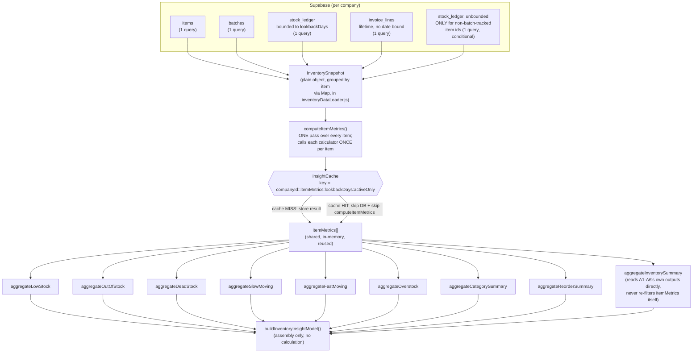
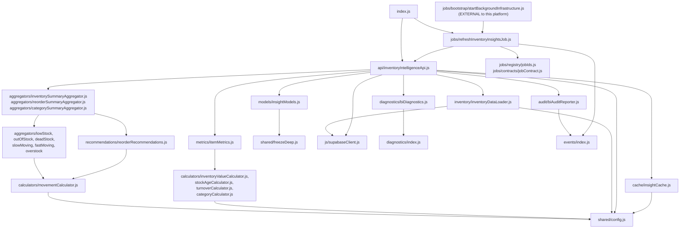

# Business Intelligence Platform — Architecture Reference

This is the permanent architectural reference for `js/services/businessIntelligence/`,
written for whoever maintains or extends this module next. It describes the system **as
it stands today**, organized by concept, not by milestone. It does not repeat the
rationale already recorded in the milestone docs — consult those when you need the "why"
behind a specific decision. Sections 1–19 below describe the Inventory Intelligence side
of this platform (Milestone 12A) exactly as that milestone left them — **frozen,
unmodified by Milestones 12B or 12C**. Section 20 covers Purchase Intelligence (12B) —
also frozen, unmodified by 12C. Section 21 covers Sales Intelligence (12C), the third
domain built on the same, shared platform foundation §§2–3 already established.

- `docs/milestones/milestone-12a-inventory-intelligence.md` / `docs/reports/milestone-12a-completion.md` — Inventory Intelligence (12A)
- `docs/milestones/milestone-12b-purchase-intelligence.md` / `docs/reports/milestone-12b-completion.md` — Purchase Intelligence (12B)
- `docs/milestones/milestone-12c-sales-intelligence.md` / `docs/reports/milestone-12c-completion.md` — Sales Intelligence (12C)

## 1. What this platform is

The Inventory Intelligence Platform is ApnaBill's **read-only Business Intelligence
layer** over the existing, already-complete Inventory/Items/Purchases/Sales modules. It
converts inventory data the ERP already stores into reusable insights — inventory value,
turnover, low/out-of-stock, dead/slow/fast-moving classification, category performance,
reorder recommendations. It is **not**:

- a new inventory module — Inventory, Items, Purchases, and Sales already exist and are
  untouched by this platform (confirmed by grep: no file under `js/items.js`,
  `js/purchases.js`, `js/sales.js`, or `schema.sql` was modified for this milestone);
- artificial intelligence, machine learning, or any predictive/statistical model —
  every number here is a deterministic calculation over data that already exists;
- a workflow engine — it never creates a purchase order, never adjusts stock, and never
  automates purchasing. Every recommendation is a suggestion a human (or a future
  Purchase Intelligence milestone) decides what to do with.

It lives entirely under `js/services/businessIntelligence/`, is a sibling of
`js/services/events/`, `js/services/diagnostics/`, `js/services/jobs/`,
`js/services/audit/`, and `js/services/extensions/`, and depends on the public barrels of
all five of those (the same shape `js/services/extensions/` already established as "the
one platform that depends on all the others; none of them import anything back from it").

## 2. The layering — exactly the brief's own diagram

```
ERP (items, batches, stock_ledger, invoice_lines -- read only)
  ↓
Metrics            (metrics/itemMetrics.js)
  ↓
Calculators        (calculators/*.js)
  ↓
Aggregators        (aggregators/*.js)
  ↓
Insight Models     (models/insightModels.js)
  ↓
Business Intelligence Services   (api/inventoryIntelligenceApi.js)
  ↓
Dashboard / Reports / Extensions   (not built by this milestone)
```

A future Dashboard/Report/Extension imports **only** from
`js/services/businessIntelligence/index.js` (or, most commonly, calls a method on the
shared `inventoryIntelligence` instance it exports) — it never reaches into
`calculators/`, `aggregators/`, or `metrics/` directly, and it never performs a
calculation itself. This is the platform's own permanent rule, mirrored from the milestone
brief: **the Dashboard must never contain calculations.**

## 3. Module map and dependency direction

```
shared/                    <- no internal deps (self-contained; deliberately not
  freezeDeep.js, now.js,       imported from events/shared/, diagnostics/shared/,
  config.js                   jobs/shared/, or audit/shared/ -- same precedent
                                every prior platform's own copy already documents).
                                config.js is the single source of truth for every
                                tunable numeric constant this platform has (§18).
  ↑
inventory/                  <- js/supabaseClient.js (supa, getActiveCompanyId) --
  inventoryDataLoader.js        the ONLY file in this platform that touches Supabase
  ↑
metrics/                    <- calculators/ (invoked once per item, per calculator)
  itemMetrics.js
  ↑
calculators/                <- no internal deps besides each other where noted
  inventoryValueCalculator.js
  stockAgeCalculator.js
  turnoverCalculator.js
  movementCalculator.js
  categoryCalculator.js
  ↑
aggregators/                <- calculators/ (movement predicates only -- never
  lowStockAggregator.js         re-derives a predicate, always imports it)
  outOfStockAggregator.js
  deadStockAggregator.js
  slowMovingAggregator.js
  fastMovingAggregator.js
  overstockAggregator.js
  inventorySummaryAggregator.js
  categorySummaryAggregator.js
  reorderSummaryAggregator.js   <- recommendations/reorderRecommendations.js
  ↑
recommendations/            <- calculators/movementCalculator.js
  reorderRecommendations.js
  ↑
models/                     <- shared/freezeDeep.js only (assembles, never calculates)
  insightModels.js
  ↑
diagnostics/                <- diagnostics/ (createStructuredLogger/
  biDiagnostics.js               createExecutionTimeline/createMetricsRecorder)
cache/                      <- no internal deps
  insightCache.js
audit/                      <- events/ (eventBus, EVENT_TYPES) -- the only file in
  biAuditReporter.js            this platform that publishes a Domain Event
extensions/                 <- no internal deps (discovery helpers only)
  capabilityNames.js
  ↑
api/                        <- inventory/, metrics/, calculators/ (via metrics),
  inventoryIntelligenceApi.js    aggregators/, recommendations/ (via aggregators),
                                 models/, diagnostics/, cache/, audit/ -- the
                                 composition root; the ONLY file that wires
                                 everything else together
  ↑
jobs/                       <- events/ (EVENT_TYPES), jobs/registry+contracts
  refreshInventoryInsightsJob.js  (direct subfolder imports, NOT jobs/index.js --
                                    see that file's own header comment for why),
                                    cache/, api/
  ↑
index.js                    <- re-exports everything above
```

Every arrow points from a more specific layer to a more generic one below it, the same
convention every prior platform's own architecture reference documents.

## 4. Public API (`js/services/businessIntelligence/index.js`)

```js
import { inventoryIntelligence, createInventoryIntelligenceApi } from '<path>/services/businessIntelligence/index.js';
```

| Export | Kind | Purpose |
|---|---|---|
| `inventoryIntelligence` | instance | The one shared, application-wide API, wired to the real Supabase-backed loader, shared cache, and shared diagnostics. Real callers use this. |
| `createInventoryIntelligenceApi({ loadSnapshot?, cache?, diagnostics?, recordAudit?, resolveActiveCompanyId? })` | factory | An isolated instance — for tests, or a deliberately separate instance. Every dependency is injectable, which is how this platform's own test suite exercises the whole composition root with zero real Supabase calls. |

### `inventoryIntelligence`'s methods

```js
await inventoryIntelligence.getInventorySummary(opts);          // -> full InventoryInsight model (§7)
await inventoryIntelligence.getInventoryValue(opts);             // -> InventoryValue model
await inventoryIntelligence.getLowStockItems(opts);              // -> item metric[]
await inventoryIntelligence.getOutOfStockItems(opts);            // -> item metric[]
await inventoryIntelligence.getDeadStock(opts);                  // -> item metric[]
await inventoryIntelligence.getSlowMovingItems(opts);            // -> item metric[]
await inventoryIntelligence.getFastMovingItems(opts);            // -> item metric[]
await inventoryIntelligence.getOverstockItems(opts);             // -> item metric[]
await inventoryIntelligence.getCategoryPerformance(opts);        // -> category summary row[]
await inventoryIntelligence.getInventoryTurnover(opts);          // -> number|null (company-wide, annualized)
await inventoryIntelligence.getReorderRecommendations(opts);     // -> { recommendations, urgentCount, ... }
await inventoryIntelligence.generateInventoryInsightReport(opts); // -> InventoryInsight model, AND records an audit entry (§9)
```

`opts` is always `{ companyId?, lookbackDays?, activeOnly?, useCache?, ...movement
threshold overrides }` — every field optional. `companyId` defaults to
`getActiveCompanyId()`; `lookbackDays` defaults to 365; `useCache` defaults to `true`.

## 5. One inventory scan, many insights — performance flow

`inventory/inventoryDataLoader.js`'s `loadInventorySnapshot()` is the **only** place this
platform queries Supabase. It runs exactly four company-scoped queries — `items`,
`batches`, `stock_ledger` (bounded to `lookbackDays`), `invoice_lines` — no matter how
many of the getX() functions above are called, and a fifth, narrowly-scoped query only
for items that are stock-tracked but not batch-tracked (§6). `api/inventoryIntelligenceApi.js`
caches the resulting per-item metrics (`metrics/itemMetrics.js`'s `computeItemMetrics()`
output) for `DEFAULT_CACHE_TTL_MS` (5 minutes, `shared/config.js`, §18) per
`{companyId, lookbackDays, activeOnly}` combination (`cache/insightCache.js`) — every
aggregator called within that window reads the same in-memory array; none of them
re-query the database or rescan raw rows itself.

Exactly what is scanned, and exactly how many times, per call:



**The reuse guarantee, concretely:** calling `getInventorySummary()`,
`getLowStockItems()`, `getDeadStock()`, `getCategoryPerformance()`, and
`getReorderRecommendations()` back-to-back for the same company performs the Supabase
scan and `computeItemMetrics()` pass **once**, not five times — the second through fifth
calls hit `insightCache` and reuse the same `itemMetrics[]` array. This is exercised
directly by `businessIntelligence.test.html`'s api-layer block ("second call with
identical opts is served from cache — loader not re-invoked").

`aggregateInventorySummary()` (§ above) is itself a second-order reuse example: it does
not re-filter `itemMetrics` — it calls the six single-purpose aggregators
(`aggregateLowStock`, `aggregateOutOfStock`, `aggregateDeadStock`, `aggregateSlowMoving`,
`aggregateFastMoving`, `aggregateOverstock`) and only counts their results, so the
movement predicates in `calculators/movementCalculator.js` are evaluated exactly once per
item per aggregator, never duplicated between a specific `getX()` call and the summary.

## 6. Known, disclosed data-model limitations

The database schema is frozen — this milestone reads it as-is, and where the schema
doesn't cleanly support a requested metric, the limitation is disclosed here rather than
worked around with a schema change:

- **No "category" column exists on `items`.** `calculators/categoryCalculator.js` uses
  `hsn_sac` (the GST tax-classification code every item already carries) as a category
  proxy — items sharing an HSN/SAC code are, in Indian retail practice, the same class of
  goods. Items with a blank/null `hsn_sac` group under `"Uncategorized"`.
- **No reservation/sales-order concept exists.** `reservedStock` is always `0` and
  `availableStock` always equals `currentStock` — there is no table anywhere that holds a
  "committed but not yet shipped" quantity.
- **Non-batch-tracked items** (`items.track_batches = false`) never get a `batches` row —
  `batches.qty_on_hand` (the authoritative running balance for batch-tracked items) does
  not exist for them. `inventory/inventoryDataLoader.js` runs one additional, narrowly-scoped,
  unbounded `stock_ledger` query — filtered to only those item ids — to compute their
  current stock instead (still "one query", not one per item).
- **`stock_ledger`'s `unit_cost` on a `'sale'` row is `null` for non-batch-tracked
  items** (confirmed by reading `sale_rpc.sql`'s own non-batch branch) — COGS, and
  therefore turnover ratio, cannot be computed for these items from this data alone; a
  `null` contributes `0` to COGS rather than being estimated. This understates turnover
  for non-batch-tracked items specifically — a real, disclosed limitation of the source
  data, not a calculation bug.
- **`stock_ledger` is read within a `lookbackDays` window** (default
  `DEFAULT_LOOKBACK_DAYS` = 365, `shared/config.js`, §18), not unbounded — an item with
  zero ledger activity inside that window still correctly
  reports `daysSinceLastSale: null` (which IS the dead-stock signal), it just cannot
  report an exact "last sold 400 days ago" date beyond the window.
- **Average Selling Price is a lifetime average**, not windowed — `invoice_lines` carries
  no date column of its own, and this milestone does not join it against `invoices` to
  keep the loader at "one query per table."
- **Average Cost is the current stock's cost basis** (qty-weighted `batches.cost_price`),
  not a historical average purchase price — that would require scanning `purchase_lines`'
  own dated history, out of scope for this metric.

## 7. Insight Models

`models/insightModels.js` assembles already-computed pieces into one deep-frozen object
— it performs no calculation itself. The full model, from `getInventorySummary()` /
`generateInventoryInsightReport()`:

```
companyId, generatedAt, lookbackDays,
inventoryValue: { totalInventoryValue, avgInventoryValuePerItem, trackedItemCount, totalStockQty },
stockTurnover:  { overallTurnoverRatio, totalCogsInWindow, lookbackDays },
summary,              -- aggregators/inventorySummaryAggregator.js's full output
lowStock, outOfStock, deadStock, slowMoving, fastMoving, overstock,  -- item metric arrays
categoryPerformance,  -- aggregators/categorySummaryAggregator.js's rows
recommendations       -- aggregators/reorderSummaryAggregator.js's output
```

## 8. Movement classification — one decision point, not duplicated per aggregator

`calculators/movementCalculator.js` is the single source of truth for
Low/Out-of-Stock/Dead/Slow/Fast/Overstock predicates (`isLowStock`, `isOutOfStock`,
`isDeadStock`, `isSlowMoving`, `isFastMoving`, `isOverstock`) — every aggregator imports
these, none re-derive the logic. Dead stock takes precedence: an item with no recent sale
is never also counted as slow-moving or overstocked, even though its turnover ratio and
days-of-cover would otherwise qualify — a dead item is a more severe signal than a merely
slow one. All thresholds (`MOVEMENT_DEFAULTS`) are overridable per call, never hardcoded
into an aggregator.

## 9. Diagnostics, caching, and audit — reused, not rebuilt

- **Diagnostics** (`diagnostics/biDiagnostics.js`): fresh instances of
  `diagnostics/`'s own `createStructuredLogger`/`createExecutionTimeline`/
  `createMetricsRecorder` factories — the same reuse pattern the Job Engine (11D) and
  Audit Platform (11E) already established. This platform never subscribes to the Event
  Bus and never starts the shared `diagnosticsObserver` — it is called directly, not
  triggered by events. Every calculation records execution time, items analyzed, and any
  warnings via one `timeline.time()`-style wrapper; cache hits/misses are logged and
  counted separately.
- **Caching** (`cache/insightCache.js`): a plain, in-memory, per-`{companyId, cacheKey}`
  TTL cache — not a new scheduler, just the store a scheduled job (§10) keeps warm. Full
  scope/invalidation/ownership/lifecycle design: §15.
- **Audit** (`audit/biAuditReporter.js`): this platform is read-only and does **not**
  audit every query — only `generateInventoryInsightReport()` (covering an on-demand
  report, a dashboard export, or the scheduled job in §10, distinguished by its
  `reportType` argument) calls `recordInventoryInsightGenerated()`, which publishes a real
  Domain Event (`EVENT_TYPES.INVENTORY_INSIGHT_GENERATED`, added to
  `events/registry/eventTypes.js` via that file's own documented "add one entry" extension
  mechanism, and to `audit/registry/auditRegistry.js` the same way) and lets the
  already-existing Audit Platform observe it like any other event. This file never writes
  an audit record itself and never starts `auditSubscriber`.

## 10. Background Jobs — reused, not rebuilt

`jobs/refreshInventoryInsightsJob.js` registers **one** job
(`JOB_IDS.REFRESH_INVENTORY_INSIGHTS`, added to `jobs/registry/jobIds.js`) with the
existing Job Engine, via `jobs/bootstrap/startBackgroundInfrastructure.js`'s own
documented extension point. Triggered by `StockAdjusted`, `PurchaseCreated`,
`SaleCreated`, and `ItemCreated` — the four events that can change what an inventory
insight would say. On trigger: invalidates the affected company's cached summary
(`insightCache.invalidateCompany`), recomputes and re-caches it via
`generateInventoryInsightReport({ reportType: 'scheduled' })` (which also records the
audit entry per §9). No new scheduler was built — this is the exact "if expensive
calculations exist, cache them using scheduled jobs... do NOT create another scheduler"
instruction this milestone was given.

## 11. Extension points

`extensions/capabilityNames.js` names three capability strings a future extension may
declare in its own `createExtensionDefinition({ capabilities: [...] })`, plus read-only
discovery helpers over the existing Capability Registry (11F) — the same "dumb,
discovery-only" pattern that registry already documents:

```
BI_CAPABILITIES.INVENTORY_INSIGHT_PROVIDER  -- contributes additional inventory insights/facts
BI_CAPABILITIES.INVENTORY_METRIC_PROVIDER   -- contributes an additional per-item metric
BI_CAPABILITIES.DASHBOARD_CARD_PROVIDER     -- contributes a renderable card for a future Dashboard
```

`getInventoryInsightProviders(extensionRuntime)` /
`getInventoryMetricProviders(extensionRuntime)` /
`getDashboardCardProviders(extensionRuntime)` each wrap
`extensionRuntime.capabilityRegistry.getProviders(name)`, returning `[]` (never throwing)
when no runtime is supplied. This module does not modify
`js/services/extensions/` itself. How a future extension actually participates: declare
the capability, subscribe to whatever Domain Events it needs via its own
`ExtensionContext`, and expose its own well-known function a future Dashboard looks up by
extension id after calling one of the discovery helpers above — the same "a consumer
decides what to do with however many providers exist" model the Capability Registry
already uses for every other capability name.

## 12. Error handling

Every layer is a pure function except `inventory/inventoryDataLoader.js` (I/O) and
`jobs/refreshInventoryInsightsJob.js` (runs inside the Job Engine's own
`executeJob()`, which never rethrows — see `docs/job-engine-architecture.md` §9). A
calculator/aggregator/model given well-formed input never throws; `api/inventoryIntelligenceApi.js`
throws only for a genuine caller error (no active company resolvable). Nothing in this
platform ever calls `eventBus.publish()` for a business-mutating fact, only for the one
disclosed audit event in §9.

## 13. Current call sites

Registered, but not yet consumed anywhere in the real UI — this milestone builds the
Business Intelligence *services* layer only, explicitly not a Dashboard (per the
milestone brief: "Do NOT build Dashboard UI"). `jobs/refreshInventoryInsightsJob.js` **is**
live (registered in `startBackgroundInfrastructure()`, which every real page's own
`boot()` already calls per 11D) — it silently keeps the cache warm; nothing in the UI
reads its output yet.

## 14. How to extend this platform

**Add a new metric**: add it to `metrics/itemMetrics.js`'s returned object, backed by a
new or existing calculator. Every aggregator that iterates `itemMetrics` picks it up for
free if it reads the field; nothing about `inventory/inventoryDataLoader.js` needs to
change unless the metric needs a column not already loaded.

**Add a new aggregator**: add a new file under `aggregators/`, importing only from
`calculators/` (never re-deriving a predicate), and wire it into
`api/inventoryIntelligenceApi.js` as a new `getX()` function plus re-export it from
`index.js`.

**Add a new capability an extension can provide**: add a new key to
`extensions/capabilityNames.js`'s `BI_CAPABILITIES` and a matching discovery helper —
nothing under `js/services/extensions/` itself needs to change.

**Milestone 12B (Purchase Intelligence) and beyond**: not started by this milestone. See
§19 below and `docs/reports/milestone-12a-completion.md` §"Readiness for Milestone 12B"
for what is already reusable (the diagnostics/cache/audit/extension wiring patterns, the
`createXApi({ loadSnapshot, cache, diagnostics, recordAudit })` dependency-injection
shape) and what a Purchase Intelligence milestone would need to build fresh (its own data
loader over `purchases`/`purchase_lines`, its own metrics/calculators/aggregators).

## 15. Cache design — scope, invalidation, ownership, lifecycle

`cache/insightCache.js`'s `createInsightCache({ ttlMs })` is a small, dependency-free,
in-memory memoization store. Four properties fully describe it:

**Scope.** One cache instance holds entries for **every** company the running page
touches, but each entry is keyed by `${companyId}::${cacheKey}` — never just `cacheKey`.
`cacheKey` itself is built by the API layer as `` `itemMetrics:${lookbackDays}:${activeOnly}` ``,
so two calls for the same company with different `lookbackDays` or `activeOnly` never
collide or share a stale entry. What is cached is exactly one thing: the
`{ companyId, generatedAt, lookbackDays, itemMetrics }` result of
`getItemMetricsSnapshot()` (the "one scan" step, §5) — never a fully-built
`InventoryInsightModel`, and never a raw Supabase response. Every `getX()` re-derives its
own aggregation from the cached `itemMetrics[]` on every call; only the expensive
scan-and-compute step is memoized.

**Invalidation.** Two independent mechanisms, never a third:
1. **Time-based (TTL)**: `get()` checks `Date.now() > entry.expiresAt` lazily, on read —
   there is no background timer sweeping the store. An expired entry is deleted the next
   time it's looked up and treated identically to a cache miss.
2. **Event-driven (explicit)**: `jobs/refreshInventoryInsightsJob.js` calls
   `insightCache.invalidateCompany(companyId)` whenever `StockAdjusted`, `PurchaseCreated`,
   `SaleCreated`, or `ItemCreated` fires for that company (§10) — deleting every entry
   whose key starts with `${companyId}::`, regardless of `cacheKey` suffix (so all
   `lookbackDays`/`activeOnly` variants for that company are invalidated together, not
   just the one combination the job happens to recompute next). `useCache: false` on any
   `getX()` call is a third, per-call bypass (skip read AND skip write) — not an
   invalidation, since it never deletes an existing entry.

**Memory ownership.** The cache owns exactly one JS `Map` in its own closure — no
external code ever holds a reference to an entry directly; every read goes through `get()`,
every write through `set()`. `api/inventoryIntelligenceApi.js` does not own the cache; it
receives one via dependency injection (`createInventoryIntelligenceApi({ cache })`,
defaulting to the shared `insightCache` singleton) and never reaches into its internal
`Map`. Nothing in this platform ever caches a DOM node, a Supabase client, or any
UI-owned object — cached values are always plain, JSON-serializable data
(`{ companyId, generatedAt, lookbackDays, itemMetrics }`), safe to hold indefinitely
without leaking a reference to something the ERP owns.

**Lifecycle.** The shared `insightCache` (exported from `cache/insightCache.js`, and from
`index.js`) is constructed once, at module load, as a singleton — the same shape every
other shared instance in this codebase uses (`eventBus`, `jobDispatcher`,
`auditSubscriber`, `extensionRuntime`). Because this is a multi-page application (no SPA
router, no persistent process), the cache's actual lifetime is **one page load**: a full
navigation re-imports the module graph and constructs a fresh, empty `insightCache` —
identical to how the Job Engine's `runHistory` and the Audit Platform's in-memory store
are already documented to reset on navigation (`docs/releases/platform-v2-foundation.md`).
There is no `clear()` call anywhere in production code; `clear()` exists (§ below) purely
for test isolation. A test, or any future caller that wants full control, constructs its
own isolated instance via `createInsightCache({ ttlMs })` instead of touching the shared
singleton — exactly the pattern `businessIntelligence.test.html`'s api-layer and
cache-specific test blocks both use.

## 16. Dependency graph and cycle verification

Every import edge under `js/services/businessIntelligence/`, plus its five external
touchpoints (`events/`, `diagnostics/`, `jobs/`, `audit/`, `extensions/`) and the one
reverse edge from `jobs/bootstrap/startBackgroundInfrastructure.js`, verified
programmatically (not just by inspection) with a small script that parses every
`import`/`export ... from` statement across all 84 files in that combined scope, resolves
relative specifiers to real files, builds the graph, and runs DFS cycle detection:

```
Scanned 84 files, 180 internal edges.
NO CYCLES DETECTED.
```

The graph is a strict DAG with this layering (each row may depend only on rows below it,
plus external platform barrels):



**Why the `jobs/bootstrap → businessIntelligence/jobs` edge is not a cycle**: it would
only become one if `refreshInventoryInsightsJob.js` imported back from `jobs/index.js`
(which re-exports `bootstrap/startBackgroundInfrastructure.js`) — it deliberately does
not; it imports `jobs/registry/jobIds.js` and `jobs/contracts/jobContract.js` directly
(the same precedent `jobs/jobs/refreshMetricsJob.js` and its siblings already establish
for the identical reason). This is the one place in the whole graph where getting the
import path wrong would have introduced a real cycle, and it's called out explicitly in
both this file and the source file's own header comment.

**No platform this one depends on imports anything back from it** — confirmed by the same
scan: zero edges originate in `events/`, `diagnostics/`, `jobs/` (other than the one
bootstrap registration line above, which is a call site, not an import of BI *logic*
back into a lower layer — `jobs/dispatcher/`, `jobs/registry/`, `jobs/lifecycle/`,
`jobs/contracts/` remain untouched), `audit/`, or `extensions/` pointing into
`businessIntelligence/`.

## 17. Module boundary verification — BI ↔ UI ↔ ERP

Two independent, disclosed constraints, both verified by grep across the entire
repository, not assumed:

**No BI module imports UI code.** Searching every `.js` file under
`js/services/businessIntelligence/` for `js/ui`, `document.`, `window.`, `innerHTML`,
`querySelector`, and `addEventListener` returns exactly zero real matches in production
code — the only two textual hits (`calculators/turnoverCalculator.js`,
`inventory/inventoryDataLoader.js`) are the English word "window" inside a comment
("lookback window", "beyond the window"), not the global `window` object, confirmed by
reading the matched lines directly. The one file that *does* use `document.` is
`businessIntelligence.test.html` itself — a test harness rendering PASS/FAIL output, the
same pattern every other platform's own `.test.html` uses, and not part of the module
graph any production code imports.

**No ERP or UI module imports BI code.** Searching the entire repository (every `.js` and
`.html` file) for the string `businessIntelligence` returns exactly ten files: eight are
inside `js/services/businessIntelligence/` itself (matching their own path in header
comments or barrel re-exports — expected), one is `js/services/jobs/jobEngine.test.html`
(a code *comment* explaining why its own job count changed from 3 to 4, not an import),
and one is the single, sanctioned, already-documented edge:
`js/services/jobs/bootstrap/startBackgroundInfrastructure.js` registering
`refreshInventoryInsightsJob` (§16). None of `js/items.js`, `js/purchases.js`,
`js/sales.js`, `js/suppliers.js`, `js/manufacturing.js`, `js/searchService.js`,
`js/gst.js`, `js/supabaseClient.js`, nor any `.html` page (`items.html`, `sale.html`,
`purchase.html`, `stock.html`, `manufacturing.html`, `suppliers.html`, `menu.html`,
`index.html`) reference this platform at all.

## 18. Configuration — no magic numbers

`shared/config.js` is the single source of truth for every tunable numeric constant this
platform uses. No calculator, aggregator, loader, or cache file defines its own literal
copy of any of these — each imports its value from here:

| Constant | Value | Used by |
|---|---|---|
| `MS_PER_DAY` | `86400000` | `calculators/stockAgeCalculator.js`, `metrics/itemMetrics.js` (batch age, days-since-last-sale/purchase) |
| `DAYS_PER_YEAR` | `365` | `calculators/turnoverCalculator.js` (annualizing a turnover ratio computed over an arbitrary `lookbackDays`) |
| `DEFAULT_LOOKBACK_DAYS` | `365` | `inventory/inventoryDataLoader.js`, `api/inventoryIntelligenceApi.js` (default `stock_ledger` scan window) |
| `DEFAULT_CACHE_TTL_MS` | `300000` (5 min) | `cache/insightCache.js` (default entry lifetime) |
| `MOVEMENT_DEFAULTS.deadStockDays` | `180` | `calculators/movementCalculator.js` (`isDeadStock`) |
| `MOVEMENT_DEFAULTS.slowMovingMaxTurnsPerYear` | `2` | `calculators/movementCalculator.js` (`isSlowMoving`) |
| `MOVEMENT_DEFAULTS.fastMovingMinTurnsPerYear` | `12` | `calculators/movementCalculator.js` (`isFastMoving`) |
| `MOVEMENT_DEFAULTS.overstockDaysOfCover` | `90` | `calculators/movementCalculator.js` (`isOverstock`) |
| `REORDER_DEFAULTS.leadTimeDays` | `7` | `recommendations/reorderRecommendations.js` |
| `REORDER_DEFAULTS.safetyStockDays` | `7` | `recommendations/reorderRecommendations.js` |
| `REORDER_DEFAULTS.noVelocityRestockMultiplier` | `2` | `recommendations/reorderRecommendations.js` (fallback target-stock heuristic when an item has zero observed sales velocity) |

`MOVEMENT_DEFAULTS` and `REORDER_DEFAULTS` are still re-exported from their historical,
documented homes (`calculators/movementCalculator.js` and
`recommendations/reorderRecommendations.js` respectively) so no existing import path or
public API surface changed when their values were consolidated here — only where the
values themselves live changed. Every one of these ten constants is overridable per call
(`opts` on any `getX()`, or a constructor argument on `createInsightCache`) — nothing here
is a value a caller is stuck with.

Deliberately **not** treated as a "magic number" needing extraction: comparisons against
`0` (e.g. `currentStock <= 0`, `totalQty > 0`) are mathematical identity/sign checks, not
tunable business thresholds — extracting `0` into a config constant would add
indirection without adding configurability.

## 19. Milestone 12B (Purchase Intelligence) — reuse, as actually built

This section originally predicted, before 12B existed, that it could be built by reusing
this pipeline with zero architectural changes. **Confirmed, and now built** — see §20 for
the full reference. What actually happened, against each original prediction:

1. `purchase/purchaseDataLoader.js` was added exactly as predicted — the only file under
   `purchase/` that touches Supabase, querying `purchases`/`purchase_lines`/`parties`.
   One deviation from the original guess: `purchase_lines` carries no date of its own, so
   this loader also attaches each line's own purchase's `billDate`/`supplierId` via an
   in-memory `Map` lookup (zero extra queries) — necessary because, unlike 12A's
   lifetime-only average selling price, Purchase Intelligence's brief explicitly required
   dated price history and trend.
2. `metrics/purchaseMetrics.js` and `metrics/supplierMetrics.js` were added, reusing
   `calculators/categoryCalculator.js`'s `resolveCategory`/`groupMetricsByCategory` and
   `calculators/turnoverCalculator.js`'s `calculateDailySalesVelocity` **exactly as
   predicted, unmodified**.
3. Nine new aggregators, one new recommendations file, and one new models file were
   added — confirmed, same layering rule.
4. `api/purchaseIntelligenceApi.js` uses the **exact same**
   `createXApi({ loadSnapshot, cache, diagnostics, recordAudit, resolveActiveCompanyId })`
   shape, confirmed.
5. **Deviated from the original prediction, deliberately.** Rather than a separate cache
   instance via `createInsightCache()`, Purchase Intelligence reuses the SAME shared
   `insightCache` singleton `api/inventoryIntelligenceApi.js` already uses — collision-free
   because every Purchase Intelligence cache key is prefixed `purchaseMetrics:...`,
   distinct from Inventory's own `itemMetrics:...` prefix. This is a closer, more literal
   reading of the 12B brief's own "Reuse the existing cache implementation... do NOT
   create another cache" than the original prediction assumed — one cache, two domains,
   for the whole Business Intelligence platform. Same reasoning applied to diagnostics:
   the SAME shared `biDiagnostics` singleton is reused by default, not a second instance.
6. One new event type (`PurchaseInsightGenerated`), one new audit registry entry, and one
   new job id + registration line were added — exactly as predicted, using the same three
   extension points §16 already exercised for 12A.

**This paragraph's original prediction (a separate sibling module) turned out wrong, and
is corrected here rather than silently deleted.** The actual 12B brief was explicit and
overrides it: "Extend `js/services/businessIntelligence/`... Reuse the existing folders...
Do NOT introduce a parallel architecture." Purchase Intelligence therefore lives as new
*sibling files within the same folders* (`purchase/`, a new file in `metrics/`, new files
in `calculators/`/`aggregators/`/`recommendations/`/`models/`/`audit/`/`api/`/`jobs/`) —
one platform, two domains, one shared `index.js` barrel, one shared cache and diagnostics
instance (§19 point 5) — not two separate platforms as originally guessed. Every existing
12A file remains byte-for-byte unchanged regardless (confirmed by `git diff` against the
`inventory-intelligence-v1.0` tag, §20). Nothing under `js/services/businessIntelligence/`
that already existed needed to change to support this — only new files were added, plus
the four small, additive registry/barrel edits §20 documents in full.

## 20. Purchase Intelligence (Milestone 12B) — architecture reference

Everything below is specific to the Purchase Intelligence domain, added to this same
platform. Sections 1–19 above (Inventory Intelligence, 12A) remain the authoritative
reference for that domain and were not modified by anything in this section.

### 20.1 What it is

Purchase Intelligence converts purchase (bill) history the ERP already stores into
reusable insights: average/last/highest/lowest purchase price, price history, cost trend
(rising/falling/stable), rolling purchase average, purchase frequency, supplier
comparison and ranking, preferred supplier, category purchase totals, and purchase
recommendations (advisory only — never creates a purchase order, never updates a
supplier record, never automates purchasing). It is **not** a purchasing module —
Purchasing (`js/purchases.js`) and Supplier Management (`js/suppliers.js`) already exist,
untouched by this milestone (confirmed by `git diff` against `inventory-intelligence-v1.0`
returning nothing for either file, or for `schema.sql`).

### 20.2 Module map addition

```
purchase/                   <- js/supabaseClient.js -- the ONLY file in this domain
  purchaseDataLoader.js         that touches Supabase
  ↑
metrics/
  purchaseMetrics.js         <- calculators/averagePriceCalculator.js,
                                 purchaseTrendCalculator.js, purchaseFrequencyCalculator.js,
                                 categoryCalculator.js (12A, frozen, reused as-is)
  supplierMetrics.js         <- calculators/supplierSpendCalculator.js,
                                 purchaseFrequencyCalculator.js
  ↑
calculators/                <- no internal deps besides each other where noted; all new
  averagePriceCalculator.js
  purchaseTrendCalculator.js     <- averagePriceCalculator.js
  purchaseFrequencyCalculator.js <- turnoverCalculator.js (12A, frozen -- calculateDailySalesVelocity reused, not copied)
  supplierSpendCalculator.js
  ↑
aggregators/                <- calculators/ + each other where noted; all new
  supplierComparisonAggregator.js    <- averagePriceCalculator.js (reads the raw PurchaseSnapshot directly -- see 20.4)
  preferredSupplierAggregator.js     <- supplierComparisonAggregator.js
  costHistoryAggregator.js           (reads the raw PurchaseSnapshot directly)
  supplierRankingAggregator.js
  purchaseTrendSummaryAggregator.js  <- purchaseTrendCalculator.js (COST_TREND)
  purchaseFrequencySummaryAggregator.js
  categoryPurchaseSummaryAggregator.js <- categoryCalculator.js (12A, frozen)
  topPurchasedItemsAggregator.js
  purchaseSummaryAggregator.js       <- purchaseTrendSummaryAggregator.js, purchaseFrequencySummaryAggregator.js
  ↑
recommendations/
  purchaseRecommendations.js  <- purchaseTrendCalculator.js (COST_TREND) + shared/config.js only
                                 -- deliberately NOT aggregators/ (same "recommendations
                                 import only from calculators/" layering
                                 reorderRecommendations.js already established); the caller
                                 (api/purchaseIntelligenceApi.js) is responsible for
                                 computing per-item supplier comparisons via the aggregator
                                 and passing them in
  ↑
models/
  purchaseInsightModels.js    <- shared/freezeDeep.js only
  ↑
diagnostics/                  <- REUSES the shared biDiagnostics singleton (12A); no new file
cache/                         <- REUSES the shared insightCache singleton (12A); no new file
audit/
  purchaseAuditReporter.js    <- events/ (eventBus, EVENT_TYPES) -- publishes PurchaseInsightGenerated
extensions/                   <- REUSES the existing three capability names (12A); no new file
  ↑
api/
  purchaseIntelligenceApi.js  <- purchase/, metrics/, aggregators/, recommendations/,
                                 models/, diagnostics/, cache/, audit/ -- the composition
                                 root for this domain
  ↑
jobs/
  refreshPurchaseInsightsJob.js <- events/ (EVENT_TYPES), jobs/registry+contracts (direct
                                    subfolder imports, not jobs/index.js -- same
                                    circular-import avoidance as 12A's own job), cache/, api/
```

### 20.3 Public API (`js/services/businessIntelligence/index.js`)

```js
import { purchaseIntelligence, createPurchaseIntelligenceApi } from '<path>/services/businessIntelligence/index.js';
```

```js
await purchaseIntelligence.getPurchaseSummary(opts);                    // -> company-wide PurchaseSummary model
await purchaseIntelligence.getAveragePurchasePrice({ itemId, ...opts }); // -> number|null
await purchaseIntelligence.getPurchaseHistory({ itemId, ...opts });      // -> full per-item PurchaseInsight model
await purchaseIntelligence.getCostHistory({ itemId, ...opts });          // -> raw chronological price/qty history only
await purchaseIntelligence.getPurchaseTrends(opts);                      // -> company-wide rising/falling/stable/insufficientData buckets
await purchaseIntelligence.getSupplierComparison({ itemId, ...opts });   // -> per-supplier price comparison for one item, cheapest first
await purchaseIntelligence.getSupplierRanking(opts);                     // -> suppliers ranked by spend/count/avgOrderValue
await purchaseIntelligence.getPreferredSupplier({ itemId, ...opts });    // -> the cheapest supplier for one item, or null
await purchaseIntelligence.getPurchaseFrequency({ itemId?, ...opts });   // -> per-item number if itemId given, else company-wide high/low buckets
await purchaseIntelligence.getTopPurchasedItems(opts);                   // -> topN items by value/qty/count
await purchaseIntelligence.getCategoryPurchases(opts);                   // -> per-category totals, highest spend first
await purchaseIntelligence.getPurchaseRecommendations(opts);             // -> one advisory recommendation per item
await purchaseIntelligence.generatePurchaseInsightReport(opts);          // -> full model, AND records an audit entry
```

`opts` is always `{ companyId?, lookbackDays?, useCache?, ...PURCHASE_DEFAULTS overrides }`.
`createPurchaseIntelligenceApi({ loadSnapshot?, cache?, diagnostics?, recordAudit?,
resolveActiveCompanyId? })` is the isolated/test factory, identical shape to
`createInventoryIntelligenceApi`.

### 20.4 One purchase scan, many insights

`purchase/purchaseDataLoader.js`'s `loadPurchaseSnapshot()` runs exactly three
company-scoped queries (a fourth is skipped entirely if the first returns zero purchases):
`purchases` (bounded to `lookbackDays` via `bill_date`, a real date column — no windowing
workaround needed here, unlike `stock_ledger`), `purchase_lines` (scoped via
`.in('purchase_id', purchaseIds)`, never its own date filter since it has no date column),
and `parties` (suppliers only). Each `purchase_line` is enriched with its own purchase's
`billDate`/`supplierId` via an in-memory `Map` lookup at load time — this is what makes
Price History / Cost Trend / Rolling Purchase Average possible at all, and is the one
place this domain's loader does more work than 12A's own `invoice_lines` reuse (which
deliberately stayed lifetime-only, see §6).

`api/purchaseIntelligenceApi.js` caches the `{ snapshot, purchaseMetrics, supplierMetrics }`
bundle under a `purchaseMetrics:${lookbackDays}` key in the SAME shared `insightCache` — a
second call to any `getX()` for the same company/window reuses that same bundle, no
re-scan, no re-computation. `supplierComparisonAggregator.js`, `preferredSupplierAggregator.js`,
and `costHistoryAggregator.js` read the raw `snapshot` (not just `purchaseMetrics`)
because per-supplier, per-item breakdown is data `metrics/purchaseMetrics.js` deliberately
aggregates away (it sums across all suppliers per item) — this is disclosed explicitly in
each of those three files' own header comments rather than silently deviating from the
"aggregators only consume metrics" shape most of the other aggregators use.

### 20.5 Cost trend classification

`calculators/purchaseTrendCalculator.js`'s `calculateCostTrend()` splits an item's
purchase history at the lookback window's midpoint, compares the qty-weighted average
price of each half (reusing `calculateAvgPurchasePrice()`, never re-deriving it), and
classifies `RISING`/`FALLING`/`STABLE`/`INSUFFICIENT_DATA` (`COST_TREND`) — the last one
returned whenever either half has zero purchases, rather than fabricating a direction
from one-sided data. `recommendations/purchaseRecommendations.js`'s `priceIncreaseWarning`/
`priceDropOpportunity` map directly onto `RISING`/`FALLING`.

### 20.6 Recommendations

`recommendations/purchaseRecommendations.js`'s `buildPurchaseRecommendation()` produces,
per item: `preferredSupplier`, `supplierConsolidationOpportunity` (bought from >=
`PURCHASE_DEFAULTS.minSuppliersForConsolidation` distinct suppliers),
`betterCostOpportunity` (current price paid is >= `betterCostThresholdPct` above the
cheapest known supplier's own average — only ever computed with 2+ suppliers to compare),
`bulkPurchaseOpportunity`/`highFrequencyAlert` (share one trigger deliberately — frequent
small purchases is exactly the signal for both), `lowFrequencyAlert`, and the two
price-trend flags above. Purely advisory, per the milestone's own "Never perform actions"
rule — no field here ever creates a purchase order or modifies a supplier record.

### 20.7 Diagnostics, cache, audit, extensions, jobs — reused, literally

- **Diagnostics**: the same shared `biDiagnostics` singleton 12A uses, by default —
  execution time, items analyzed, suppliers compared, cache hit/miss, warnings, all via
  the same `diagnostics.time()` wrapper.
- **Cache**: the same shared `insightCache` singleton, namespaced by a distinct key
  prefix (§19 point 5) — not a second cache implementation.
- **Audit**: one new, narrow file (`audit/purchaseAuditReporter.js`) publishing one new,
  additive event type (`EVENT_TYPES.PURCHASE_INSIGHT_GENERATED`) — audited only via
  `generatePurchaseInsightReport()`, never on a routine `getX()` read, mirroring
  `biAuditReporter.js`'s own boundary exactly.
- **Extensions**: no new capability names were added. The three existing
  `BI_CAPABILITIES` (`InventoryInsightProvider`, `InventoryMetricProvider`,
  `DashboardCardProvider`) already cover what a future extension needs — a purchase-facing
  extension can declare `DASHBOARD_CARD_PROVIDER` for a purchase-related dashboard card,
  or subscribe to `PurchaseInsightGenerated` directly via its own `ExtensionContext`,
  without a new, purchase-specific capability constant. `extensions/capabilityNames.js`
  was not modified.
- **Jobs**: one new job (`refreshPurchaseInsightsJob`), triggered by `PurchaseCreated`
  and `SupplierCreated`, registered via `startBackgroundInfrastructure()`'s own documented
  extension point. `PurchaseCreated` is also one of `refreshInventoryInsightsJob`'s own
  trigger events — both jobs firing on the same event and both calling
  `insightCache.invalidateCompany(companyId)` on the shared cache is intentional and
  harmless (a purchase changes both inventory levels and purchase-price history for that
  company), not a race condition worth avoiding.

### 20.8 Known, disclosed limitations (Purchase Intelligence-specific)

- **Purchase Intelligence's own metrics/aggregators are scoped to items and suppliers
  actually purchased within the lookback window** — like 12A's own item scan, this is
  purchase-*history* analysis, not a master-data directory (that remains `js/suppliers.js`'s
  own job).
- **`grandTotal`/`lineTotal` are used as-is from `purchases`/`purchase_lines`** (already
  tax-inclusive per the existing schema's own computation in `purchases.js`/`sale_rpc.sql`-
  style RPCs) — this domain does not re-derive taxable value or GST breakdowns.
- **The cost-trend midpoint split is a simple two-half comparison**, not a regression or
  seasonality-aware model — deliberately simple, matching the "deterministic calculation,
  not statistics/ML" spirit of the whole platform.
- **`betterCostOpportunity` compares against the cheapest supplier's own historical
  average**, not a live quote — it can flag a supplier who was cheap in the past but may
  no longer be, since Purchase Intelligence has no real-time pricing feed (none exists in
  this ERP).

### 20.9 Dependency graph update

Re-running the same programmatic cycle-detection method §16 used (parsing every
`import`/`export ... from` across `businessIntelligence/` + its five external
touchpoints): **106 files, 260 edges, zero cycles** — up from 12A's own 84 files/180
edges, the +22 files/+80 edges being exactly this milestone's new purchase-domain files.
The two reverse edges from `jobs/bootstrap/startBackgroundInfrastructure.js` (one per
milestone's own job) remain the only edges pointing INTO `businessIntelligence/` from
outside it — confirmed by the same repository-wide grep method §17 used, extended to the
new `purchase*`-named files: exactly ten hits total, eight inside
`businessIntelligence/` itself, one a code comment in `jobEngine.test.html`, and the one
sanctioned job-registration edge.

### 20.10 Milestone 12C (Sales Intelligence) — reuse, as actually built

This section originally predicted, before 12C existed, that a Sales Intelligence
milestone would add `sales/salesDataLoader.js`, reuse `turnoverCalculator.js` and
`categoryCalculator.js` as-is, use the identical `createXApi(...)` DI shape, reuse the
same shared cache/diagnostics singletons with a third key prefix, and add one more
additive event type/job id/registration line with no new capability names. **Confirmed,
and now built** — see §21 for the full reference. 12C went further than predicted: it
also reuses `calculators/averagePriceCalculator.js`, `calculators/purchaseTrendCalculator.js`
(including its `COST_TREND` enum and field name, specifically so
`aggregators/purchaseTrendSummaryAggregator.js` could be reused verbatim too),
`calculators/purchaseFrequencyCalculator.js`, `calculators/supplierSpendCalculator.js`,
and `aggregators/topPurchasedItemsAggregator.js` — all verbatim, none modified. The one
place 12C did NOT reuse a 12B aggregator it structurally could have
(`purchaseFrequencySummaryAggregator.js`) is documented as a deliberate exception in §21.7
and `docs/reports/milestone-12c-completion.md` §4 — reusing it would have silently
returned wrong results against a differently-named field, not just an inconsistent name.

## 21. Sales Intelligence (Milestone 12C) — architecture reference

Everything below is specific to the Sales Intelligence domain, added to this same
platform. Sections 1–20 above (Inventory Intelligence 12A, Purchase Intelligence 12B)
remain the authoritative reference for those domains and were not modified by anything in
this section.

### 21.1 What it is

Sales Intelligence converts sales (invoice) history the ERP already stores into reusable
insights: average/last/highest/lowest selling price, revenue (gross/net/returns), gross
margin, sales trend, sales frequency/velocity, top/worst selling items, category and
customer ranking, seasonality, and advisory recommendations (high demand, declining
products, customer retention, upsell, cross-sell). It is **not** a sales module —
Sales/Billing (`js/sales.js`) already exists, untouched by this milestone (confirmed by
`git diff` against `purchase-intelligence-v1.0` returning nothing for it, or for
`schema.sql`).

### 21.2 Module map addition

```
sales/                       <- js/supabaseClient.js -- the ONLY file in this domain
  salesDataLoader.js             that touches Supabase
  ↑
metrics/
  salesMetrics.js             <- calculators/averagePriceCalculator.js,
                                  purchaseTrendCalculator.js, turnoverCalculator.js,
                                  purchaseFrequencyCalculator.js, categoryCalculator.js
                                  (ALL reused verbatim, 12A/12B, frozen), plus
                                  revenueCalculator.js, marginCalculator.js (new)
  customerMetrics.js          <- calculators/supplierSpendCalculator.js,
                                  turnoverCalculator.js, purchaseFrequencyCalculator.js,
                                  categoryCalculator.js (ALL reused verbatim)
  ↑
calculators/                 <- no internal deps besides each other where noted; ONLY
                                 these two are new -- every other price/trend/frequency/
                                 spend calculation reuses 12A/12B verbatim (§21.7)
  revenueCalculator.js
  marginCalculator.js
  ↑
aggregators/                 <- calculators/ + each other where noted
  categorySalesSummaryAggregator.js  <- categoryCalculator.js (12A, frozen, reused)
  worstSellingItemsAggregator.js
  seasonalitySummaryAggregator.js    (reads the raw SalesSnapshot directly -- same
                                       disclosed exception aggregators/supplierComparisonAggregator.js
                                       (12B) established for needing snapshot-level detail)
  salesFrequencySummaryAggregator.js
  customerRankingAggregator.js       <- supplierRankingAggregator.js (12B, frozen, delegated)
  revenueRankingAggregator.js        <- supplierRankingAggregator.js (12B, frozen, delegated)
  salesSummaryAggregator.js          <- purchaseTrendSummaryAggregator.js (12B, frozen,
                                         reused VERBATIM), salesFrequencySummaryAggregator.js
  ↑
  -- NOT present, by design: a "salesTrendSummaryAggregator.js" (purchaseTrendSummaryAggregator.js
     is reused verbatim, §21.7) and a "topSellingItemsAggregator.js"/"topCustomersAggregator.js"
     (topPurchasedItemsAggregator.js, 12B, frozen, is reused verbatim for both)
recommendations/
  salesRecommendations.js     <- purchaseTrendCalculator.js (COST_TREND, reused verbatim)
                                 + shared/config.js only -- same "recommendations import
                                 only from calculators/" layering reorderRecommendations.js
                                 (12A) and purchaseRecommendations.js (12B) both established
  ↑
models/
  salesInsightModels.js       <- shared/freezeDeep.js only
  ↑
diagnostics/                  <- REUSES the shared biDiagnostics singleton; no new file
cache/                         <- REUSES the shared insightCache singleton; no new file
audit/
  salesAuditReporter.js       <- events/ (eventBus, EVENT_TYPES) -- publishes SalesInsightGenerated
extensions/                   <- REUSES the existing three capability names; no new file
  ↑
api/
  salesIntelligenceApi.js     <- sales/, metrics/, aggregators/, recommendations/,
                                 models/, diagnostics/, cache/, audit/ -- the composition
                                 root for this domain
  ↑
jobs/
  refreshSalesInsightsJob.js  <- events/ (EVENT_TYPES), jobs/registry+contracts (direct
                                  subfolder imports, not jobs/index.js -- same
                                  circular-import avoidance as 12A/12B's own jobs), cache/, api/
```

### 21.3 Public API (`js/services/businessIntelligence/index.js`)

```js
import { salesIntelligence, createSalesIntelligenceApi } from '<path>/services/businessIntelligence/index.js';
```

```js
await salesIntelligence.getSalesSummary(opts);              // -> company-wide SalesSummary model
await salesIntelligence.getRevenueSummary(opts);             // -> revenue/margin headline figures only
await salesIntelligence.getSalesTrends(opts);                // -> rising/falling/stable/insufficientData buckets (REUSED aggregator)
await salesIntelligence.getTopSellingItems(opts);            // -> topN items by netSales/unitsSold (REUSED aggregator)
await salesIntelligence.getWorstSellingItems(opts);          // -> bottomN items, ascending
await salesIntelligence.getCustomerRanking(opts);            // -> customers ranked by spend/orders
await salesIntelligence.getCategoryPerformance(opts);        // -> per-category sales totals, highest first
await salesIntelligence.getSalesRecommendations(opts);       // -> { items: [...], customers: [...] }
await salesIntelligence.getTopCustomers(opts);                // -> topN customers (REUSED aggregator, over customer metrics)
await salesIntelligence.getSeasonality(opts);                 // -> monthly {month, netSales, unitsSold, orderCount} series
await salesIntelligence.getRevenueRanking(opts);              // -> full item ranking by revenue
await salesIntelligence.generateSalesInsightReport(opts);     // -> full model, AND records an audit entry
```

Full function-by-function contract (purpose, input, output, errors, caching, diagnostics,
example): `docs/architecture/business-intelligence-api.md` §6.

### 21.4 One sales scan, many insights

`sales/salesDataLoader.js`'s `loadSalesSnapshot()` runs exactly four queries (a fifth,
`batches`, is skipped if no line references one): `invoices` (bounded to `lookbackDays`
via `invoice_date`, scoped to `doc_type IN ('sale','sale_return')`), `parties`
(customers), `invoice_lines` (scoped via `.in('invoice_id', invoiceIds)`), and `batches`
(cost_price only, scoped to the batch ids `invoice_lines` actually reference, for the
gross margin calculator). Each `invoice_line` is enriched with its own invoice's
`invoiceDate`/`partyId`/`docType`, plus a `billDate` alias equal to `invoiceDate` and a
resolved `batchCostPrice` — both deliberate, see §21.7.

`api/salesIntelligenceApi.js` caches the `{ snapshot, salesMetrics, customerMetrics }`
bundle under a `salesMetrics:${lookbackDays}` key in the SAME shared `insightCache` 12A
and 12B already use — a third, collision-free prefix in the same Map.

### 21.5 Gross/net sales and margin

`calculators/revenueCalculator.js` distinguishes `invoices.doc_type` (`'sale'` vs
`'sale_return'`) to compute `grossSales`, `returnsValue`, `netSales`, `netUnitsSold`, and
`returnRate` — the one genuinely new numeric domain this milestone adds (12A/12B have no
returns concept). **Known, disclosed limitation**: `js/sales.js`'s `saveSaleFromCart()`
(via `create_sale`, `sale_rpc.sql`) always writes `doc_type = 'sale'` — no workflow in
this ERP ever writes a `'sale_return'` row today. `calculateReturnRate()` will read
`0`/`null` for every real company until a future milestone implements sale returns
against the existing schema, at which point it becomes meaningful with no code change
here — the same disclosed-gap pattern 11B's own report already established for
`PurchaseDeleted`/`SaleCancelled`/`ManufacturingStarted`.

`calculators/marginCalculator.js` computes gross margin only for lines with a resolved
`batchCostPrice` — a line whose batch could not be resolved (non-batch-tracked item, or a
missing batch) is excluded from both the margin numerator and the revenue denominator,
never treated as zero-cost (which would overstate margin). Same disclosed limitation
class as 12A's own COGS calculation for non-batch-tracked items.

### 21.6 Recommendations

`recommendations/salesRecommendations.js` produces two kinds of recommendation, both
advisory-only per the milestone's own "never modify ERP data, never generate invoices,
never automate actions" rule:

- **Per item**: `highDemandItem`/`fastSellingProduct` (share one trigger deliberately,
  the same "two names, one signal" precedent `purchaseRecommendations.js`'s
  `bulkPurchaseOpportunity`/`highFrequencyAlert` pair established), `decliningProduct`/
  `productWithFallingRevenue` (from the reused `costTrend === FALLING`),
  `productRequiresAttention` (a composite of the two: declining AND low performing —
  not a new calculation, a combination of two already-computed signals).
- **Per customer**: `customerRetentionOpportunity` (overdue by more than
  `retentionGapMultiplier` × their own `avgDaysBetweenPurchases`), `upsellOpportunity`
  (their `avgOrderValue` below `upsellBelowCompanyAvgPct`% of the company-wide average),
  `crossSellOpportunity` (categories among the company's top 3 by revenue that this
  customer has never purchased from). Both `companyAvgOrderValue` and `topCategories` are
  precomputed by the caller (`api/salesIntelligenceApi.js`) and passed in as plain
  arguments — this file never recomputes them itself, the same discipline
  `purchaseRecommendations.js`'s `supplierComparison` parameter already established.

### 21.7 Deep reuse — the deliberate exception

Sales metrics keep the field name `costTrend` (not `salesTrend`) and `salesDataLoader.js`
attaches a `billDate` alias equal to `invoiceDate` on every line, specifically so
`calculators/averagePriceCalculator.js`, `calculators/purchaseTrendCalculator.js`
(including `COST_TREND`), and `aggregators/purchaseTrendSummaryAggregator.js` — all
12B, frozen — work completely unmodified against sale lines. `calculators/turnoverCalculator.js`'s
`calculateDailySalesVelocity` (12A) and `calculators/purchaseFrequencyCalculator.js`'s
`annualizePurchaseFrequency`/`calculateAvgDaysBetweenPurchases` (12B) are reused the same
way. `aggregators/topPurchasedItemsAggregator.js` (12B) is reused verbatim for both "Top
Selling Items" and "Top Customers" — its sort-desc-slice logic never referenced anything
purchase-specific.

**The one deliberate exception**: `aggregators/purchaseFrequencySummaryAggregator.js`
hardcodes `.purchaseFrequencyPerYear` — a field name that would be actively misleading on
a public Sales Intelligence row. Reusing it verbatim against `salesFrequencyPerYear`-named
metrics would not just look odd, it would silently return empty results (a wrong answer).
`aggregators/salesFrequencySummaryAggregator.js` is therefore a new, ~15-line file with the
identical shape, not a reuse — the one place in this milestone where "generalize it, don't
duplicate it" was judged, explicitly, not to apply.

### 21.8 Diagnostics, cache, audit, extensions, jobs — reused, literally

Identical reuse shape to §20.7 (Purchase Intelligence): the same shared `biDiagnostics`
and `insightCache` singletons (a third key prefix), no new capability names
(`extensions/capabilityNames.js` untouched), one new, narrow audit file
(`audit/salesAuditReporter.js`) publishing one new, additive event type
(`EVENT_TYPES.SALES_INSIGHT_GENERATED`), and one new job (`refreshSalesInsightsJob`,
triggered by `SaleCreated`/`CustomerCreated`) registered via
`startBackgroundInfrastructure()`'s own documented extension point.

### 21.9 Dependency graph update

Re-running the same programmatic cycle-detection method §16 used: **123 files, 327
edges, zero cycles** — up from 12B's own 106 files/260 edges, the +17 files/+67 edges
being exactly this milestone's new sales-domain files. The three reverse edges from
`jobs/bootstrap/startBackgroundInfrastructure.js` (one per milestone's own job) remain the
only edges pointing INTO `businessIntelligence/` from outside it — confirmed by the same
repository-wide grep method §17 used, extended to the new sales-named files.

### 21.10 Milestone 12D readiness

Not predicted here in detail — per this milestone's own explicit instruction, 12D is not
started and not designed. What can be said, proven three times over now (Inventory,
Purchase, Sales all built on the identical pipeline): any future domain reuses the same
`createXApi(...)` shape, the same shared cache/diagnostics singletons with a fourth
distinct key prefix, and the same three registry-extension points — and, per §21.7's own
lesson, should audit whether an existing calculator/aggregator is *genuinely* reusable
verbatim (field names match, logic is domain-agnostic) before assuming reuse is always
possible just because the shapes look similar.

## 22. Pricing Intelligence (Milestone 12D) — architecture reference

Everything below is specific to the Pricing Intelligence domain, added to this same
platform. Sections 1–21 above (Inventory Intelligence 12A, Purchase Intelligence 12B,
Sales Intelligence 12C) remain the authoritative reference for those domains and were not
modified by anything in this section.

### 22.1 What it is

Pricing Intelligence converts the sell-side and buy-side price history the ERP already
stores — via 12B's own Purchase Intelligence and 12C's own Sales Intelligence, both reused
verbatim, not re-scanned — into reusable insights: current/average/historical/highest/
lowest selling and purchase price, price difference, margin %, markup %, gross margin,
price stability/volatility, average/maximum discount and discount frequency, price trend,
and advisory recommendations (low margin, high discount, price increase/reduction
opportunity, price consistency, supplier cost increase). It is **read-only and
advisory-only, exactly like every prior domain**: it never changes an item's price, a
purchase price, or a selling price, and it never touches the Item, Purchase, or Sales
workflows.

### 22.2 Module map addition

```
pricing/                     <- the ONLY new file that touches Supabase directly, and
  pricingDataLoader.js           only for ONE new query (items' current prices) --
                                  everything else is composed by REUSING
                                  loadPurchaseSnapshot()/loadSalesSnapshot() (12B/12C,
                                  frozen) verbatim, zero duplicate queries
  ↑
metrics/
  pricingMetrics.js           <- computeSalesMetrics()/computePurchaseMetrics() (12B/12C,
                                  reused wholesale, not re-derived) + calculators/
                                  pricingCalculator.js, discountCalculator.js,
                                  priceVolatilityCalculator.js (all new, §22.5)
  ↑
calculators/                 <- percentageCalculator.js is the mandatory single shared
                                 ratio formula (§22.5) every other new calculator below
                                 routes through; no other calculator in this platform
                                 needed to change
  percentageCalculator.js
  pricingCalculator.js         <- percentageCalculator.js
  discountCalculator.js        <- percentageCalculator.js
  priceVolatilityCalculator.js <- percentageCalculator.js, shared/config.js (PRICING_DEFAULTS)
  ↑
aggregators/                  <- calculators/ + each other where noted
  pricingSummaryAggregator.js         <- priceTrendSummaryAggregator.js,
                                          marginThresholdAggregator.js,
                                          discountSummaryAggregator.js (composes, never
                                          re-derives, same rule inventorySummaryAggregator.js/
                                          purchaseSummaryAggregator.js/salesSummaryAggregator.js
                                          (12A/12B/12C) all established)
  categoryPricingSummaryAggregator.js  <- categoryCalculator.js (12A, frozen, reused)
  marginThresholdAggregator.js         (new predicate, not a sort -- see §22.6)
  discountSummaryAggregator.js
  priceTrendSummaryAggregator.js       <- purchaseTrendSummaryAggregator.js (12B, frozen,
                                          delegated via a one-field remap, §22.7)
  sellingPriceHistoryAggregator.js     (mirrors costHistoryAggregator.js's shape for
                                          sale lines -- cannot reuse it verbatim, different
                                          snapshot field names, §22.7)
  ↑
  -- NOT present, by design: "Highest/Lowest Margin Items" and "Most Discounted Items"
     aggregators. `aggregators/topPurchasedItemsAggregator.js` and
     `aggregators/worstSellingItemsAggregator.js` (both 12B/12C, frozen) are reused
     verbatim instead -- the same "generic top-N/bottom-N by field" reuse Sales
     Intelligence already relied on for Top/Worst Selling Items (§21.7).
recommendations/
  pricingRecommendations.js    <- calculators/priceVolatilityCalculator.js (PRICE_STABILITY),
                                  calculators/purchaseTrendCalculator.js (COST_TREND, reused
                                  verbatim) + shared/config.js only -- same
                                  "recommendations import only from calculators/" layering
                                  every prior domain's own recommendations file established
  ↑
models/
  pricingInsightModels.js      <- shared/freezeDeep.js only
  ↑
diagnostics/                   <- REUSES the shared biDiagnostics singleton; no new file
cache/                          <- REUSES the shared insightCache singleton; no new file
audit/
  pricingAuditReporter.js      <- events/ (eventBus, EVENT_TYPES) -- publishes PricingInsightGenerated
extensions/                    <- REUSES the existing three capability names; no new file
  ↑
api/
  pricingIntelligenceApi.js    <- pricing/, metrics/, aggregators/, recommendations/,
                                  models/, diagnostics/, cache/, audit/ -- the composition
                                  root for this domain
  ↑
jobs/
  refreshPricingInsightsJob.js <- events/ (EVENT_TYPES), jobs/registry+contracts (direct
                                   subfolder imports, not jobs/index.js -- same
                                   circular-import avoidance as every prior domain's own jobs),
                                   cache/, api/
```

### 22.3 Public API (`js/services/businessIntelligence/index.js`)

```js
import { pricingIntelligence, createPricingIntelligenceApi } from '<path>/services/businessIntelligence/index.js';
```

```js
await pricingIntelligence.getPricingSummary(opts);          // -> company-wide PricingSummary model
await pricingIntelligence.getMarginAnalysis(opts);           // -> avgMarginPct + above/below-target split
await pricingIntelligence.getMarkupAnalysis(opts);           // -> avgMarkupPct + every item's own markup %
await pricingIntelligence.getPriceHistory({ itemId, ...opts }); // -> {purchaseHistory, sellingHistory}, both sides at once
await pricingIntelligence.getPriceTrends(opts);              // -> rising/falling/stable/insufficientData buckets (REUSED aggregator, remapped)
await pricingIntelligence.getDiscountAnalysis(opts);         // -> company-wide discount rollup + most-discounted items
await pricingIntelligence.getHighestMarginItems(opts);       // -> topN items by marginPct (REUSED aggregator)
await pricingIntelligence.getLowestMarginItems(opts);        // -> bottomN items by marginPct (REUSED aggregator)
await pricingIntelligence.getCategoryPricing(opts);          // -> per-category avg margin/markup %, highest first
await pricingIntelligence.getPricingRecommendations(opts);   // -> one advisory recommendation per item
await pricingIntelligence.generatePricingInsightReport(opts); // -> full model, AND records an audit entry
```

Full function-by-function contract (purpose, input, output, errors, caching, diagnostics,
example): `docs/architecture/business-intelligence-api.md` §7.

### 22.4 One pricing scan, many insights — and TWO other domains' scans reused, not repeated

`pricing/pricingDataLoader.js`'s `loadPricingSnapshot()` is structurally different from
every prior domain's own loader: instead of running its own queries against
`purchases`/`purchase_lines` or `invoices`/`invoice_lines`, it calls
`loadPurchaseSnapshot()` and `loadSalesSnapshot()` (12B/12C, both frozen, both reused
verbatim) in parallel, and adds exactly **one** new query of its own — `items`, for each
item's own `default_purchase_price`/`default_retail_price`/`default_wholesale_price` (the
item master's configured "current" prices, which neither existing snapshot loads; both
only ever load transaction-line prices). This is "one pricing scan powers multiple
insights" taken one level further than any prior domain: the scan itself is a composition
of two already-existing scans plus one small addition, not a fresh one.

`purchase/purchaseDataLoader.js` and `sales/salesDataLoader.js` (12B/12C) each received one
small, purely additive change for this milestone: their existing `purchase_lines`/
`invoice_lines` `.select()` calls now also read `discount_pct`/`discount_amt` (both
columns already existed in `schema.sql`, simply unread until now), exposed as
`discountPct`/`discountAmt` on the enriched line objects. No existing field, query shape,
or return value changed — this is the same additive-extension precedent
`shared/config.js`/`index.js`/the three registry files already establish at the
infrastructure level, applied here to a domain loader for the first time. It was the
correct call, not a new parallel query, specifically because re-querying either table a
second time just for two more columns would have violated this milestone's own "avoid
repeated database queries" rule.

`api/pricingIntelligenceApi.js` caches the `{ snapshot, pricingMetrics }` bundle under a
`pricingMetrics:${lookbackDays}` key in the SAME shared `insightCache` 12A/12B/12C already
use — a fourth, collision-free prefix in the same Map.

### 22.5 The mandatory single shared percentage calculator

This milestone's own brief adds one internal rule beyond every prior domain's: **every
percentage calculation (margin %, markup %, discount %) must come from a single shared
calculator** — no separate margin/markup/discount formula may exist in different
aggregators, to prevent subtle inconsistencies across Pricing Intelligence, a future
Supplier Intelligence (12E), and a future Business Dashboard (12F).

`calculators/percentageCalculator.js` is that single source of truth: one function,
`calculatePercentage(numerator, denominator)`, returning `null` when the denominator is
`<= 0` or either input is missing rather than `NaN`/`Infinity`/a misleading negative-base
percentage. Every other new calculator in this domain imports it rather than re-deriving
`(x / y) * 100`:

- `calculators/pricingCalculator.js` — `calculateMarginPct(sellingPrice, cost)` (profit as
  % of selling price) and `calculateMarkupPct(sellingPrice, cost)` (profit as % of cost)
  both call `calculatePercentage()` for their own division.
- `calculators/discountCalculator.js` — `calculateAverageDiscountPct`/`calculateMaxDiscountPct`
  trust each line's own stored `discountPct` first, falling back to a derived % via
  `calculatePercentage(discountAmt, taxableValue + discountAmt)` only when `discountPct`
  reads 0 but `discountAmt` does not (a manual flat discount entered without a %).
  `calculateDiscountFrequency` (% of lines carrying any discount) also calls
  `calculatePercentage()`.
- `calculators/priceVolatilityCalculator.js` — the coefficient of variation
  (`stdDev / mean`) is itself a percentage, so `calculatePriceVolatility()` calls
  `calculatePercentage(stdDev, mean)` rather than computing the ratio inline.

**Known, disclosed non-reuse**: `calculators/marginCalculator.js` (12C, frozen) already
computes a `grossMarginPct` — but that figure is transaction-level (batch cost basis vs.
actual line revenue, aggregated across every sale line), not the same computation as this
domain's `marginPct` (a single price-point comparison: average/current selling price vs.
average/current purchase price). `metrics/pricingMetrics.js` carries 12C's `grossMargin`/
`grossMarginPct` through **unmodified**, alongside its own, distinct `marginPct`/
`markupPct` — two genuinely different, both legitimate, margin figures on the same row,
never conflated. (`calculators/marginCalculator.js` itself was correctly left untouched:
rewriting a frozen, already-shipped calculator to serve a new, differently-scoped
computation would have been exactly the "duplicate logic by force-fitting reuse" mistake
§21.7's own lesson warns against.)

### 22.6 Reuse Audit (mandatory, per this milestone's own brief)

**Components reused verbatim (zero modification, called directly):**
`calculators/averagePriceCalculator.js` (avg/last/highest/lowest price, both sides, 12B),
`calculators/purchaseTrendCalculator.js` (`COST_TREND`, `calculateCostTrend`,
`calculateRollingPurchaseAverage`, 12B), `calculators/categoryCalculator.js` (12A),
`metrics/salesMetrics.js`'s `computeSalesMetrics` (12C), `metrics/purchaseMetrics.js`'s
`computePurchaseMetrics` (12B), `sales/salesDataLoader.js`'s `loadSalesSnapshot` (12C),
`purchase/purchaseDataLoader.js`'s `loadPurchaseSnapshot` (12B),
`aggregators/topPurchasedItemsAggregator.js` (12B, for Highest Margin Items and Most
Discounted Items), `aggregators/worstSellingItemsAggregator.js` (12C, for Lowest Margin
Items), `aggregators/costHistoryAggregator.js` (12B, for purchase-side price history),
`cache/insightCache.js`, `diagnostics/biDiagnostics.js`, `shared/freezeDeep.js`.

**Components generalized (new, thin delegation files — zero new logic):**
`aggregators/priceTrendSummaryAggregator.js` (one-line delegate to
`purchaseTrendSummaryAggregator.js` via a `sellingPriceTrend` → `costTrend` field remap,
the same pattern `aggregators/customerRankingAggregator.js`, 12C, established for
`supplierRankingAggregator.js`).

**New components (genuinely new logic), and why each was necessary:**
`calculators/percentageCalculator.js` (the mandatory single shared ratio formula, §22.5 —
did not exist because no prior domain needed one shared entry point for multiple
independently-computed percentages), `calculators/pricingCalculator.js` (margin %/markup %
— no existing calculator compares a selling price against a purchase price; 12C's own
margin figure is revenue-based, not price-point-based, §22.5), `calculators/discountCalculator.js`
(no existing calculator reads `discountPct`/`discountAmt` — those columns were unread by
this platform before this milestone), `calculators/priceVolatilityCalculator.js` (no
existing calculator measures price dispersion — `costTrend` classifies *direction*, a
different question), `pricing/pricingDataLoader.js` (the composition loader, §22.4 — no
prior domain needed two other domains' snapshots at once), `metrics/pricingMetrics.js`
(the sell-vs-buy join, §22.5), `aggregators/pricingSummaryAggregator.js`,
`aggregators/categoryPricingSummaryAggregator.js`, `aggregators/marginThresholdAggregator.js`
(a predicate classification against a configurable target, not a sort — no existing
aggregator does this), `aggregators/discountSummaryAggregator.js`,
`aggregators/sellingPriceHistoryAggregator.js` (mirrors `costHistoryAggregator.js`'s shape
but cannot reuse it verbatim — different snapshot field names, the same "new file, not a
forced reuse" call `aggregators/worstSellingItemsAggregator.js`'s own 12C header comment
made), `recommendations/pricingRecommendations.js`, `models/pricingInsightModels.js`,
`audit/pricingAuditReporter.js`, `api/pricingIntelligenceApi.js`,
`jobs/refreshPricingInsightsJob.js`.

**A real correctness gap found and fixed during this reuse audit**: `aggregateTopPurchasedItems`/
`aggregateWorstSellingItems` (both reused verbatim, frozen) sort via `a[by] || 0` — correct
when a metric is genuinely absent-as-zero, but a `null` `marginPct`/`avgDiscountPct` means
"no price-point to compare" (never sold, or never purchased), not "zero margin/discount".
`api/pricingIntelligenceApi.js` filters to items with a non-null value before calling
either frozen aggregator for any margin/discount ranking — the aggregators themselves were
correctly left unmodified; the filter lives in the one place that knows what "null" means
for this domain.

### 22.7 Deep reuse — the deliberate exceptions

Two domains' entire scan pipelines (`loadPurchaseSnapshot`/`computePurchaseMetrics`,
`loadSalesSnapshot`/`computeSalesMetrics`) are reused wholesale rather than re-implemented
or re-derived — this domain's only genuinely new scan work is one `items` query
(§22.4). `sellingPriceTrend`/`purchasePriceTrend` on `metrics/pricingMetrics.js`'s own row
are plain aliases of `salesMetrics`'s/`purchaseMetrics`'s own `costTrend` field — zero new
trend-classification logic, the same aliasing precedent §21.7 established for sales
reusing purchase-side calculators.

**The one deliberate non-reuse**: `aggregators/sellingPriceHistoryAggregator.js` mirrors
`aggregators/costHistoryAggregator.js`'s exact shape (chronological `{date, rate, qty,
...}` rows for one item) but is a new, ~15-line file, not a reuse — `costHistoryAggregator.js`
reads `PurchaseSnapshot`'s own `purchaseLinesByItem`/`purchaseId`/`supplierId` field names,
and this needs `SalesSnapshot`'s `invoiceLinesByItem`/`invoiceId`/`partyId` instead. The
same judgment call §21.7 made for `salesFrequencySummaryAggregator.js`: reusing a
field-name-specific function against a differently-shaped snapshot would not just look
odd, it would silently return empty results.

### 22.8 Diagnostics, cache, audit, extensions, jobs — reused, literally

Identical reuse shape to §20.7/§21.8: the same shared `biDiagnostics` and `insightCache`
singletons (a fourth key prefix, `pricingMetrics:...`), no new capability names
(`extensions/capabilityNames.js` untouched), one new, narrow audit file
(`audit/pricingAuditReporter.js`) publishing one new, additive event type
(`EVENT_TYPES.PRICING_INSIGHT_GENERATED`), and one new job (`refreshPricingInsightsJob`,
triggered by `SaleCreated`/`PurchaseCreated` — a pricing insight joins both sides)
registered via `startBackgroundInfrastructure()`'s own documented extension point.

### 22.9 Dependency graph update

Re-running the same programmatic cycle-detection method §16 used: **140 files, 399
edges, zero cycles** — up from 12C's own 123 files/327 edges, the +17 files/+72 edges
being exactly this milestone's new pricing-domain files (16 new source files under
`businessIntelligence/` plus one new test harness, `pricingIntelligence.test.html`, not
counted in the scan since it is not a `.js` module). The four reverse edges from
`jobs/bootstrap/startBackgroundInfrastructure.js` (one per domain's own refresh job) remain
the only edges pointing INTO `businessIntelligence/` from outside it — confirmed by the
same repository-wide scan §17 used, extended to the new pricing-named files.

### 22.10 Milestone 12E readiness

Not predicted here in detail — per this milestone's own explicit instruction, 12E
(Supplier Intelligence) is not started and not designed. What can be said, proven four
times over now (Inventory, Purchase, Sales, Pricing all built on the identical pipeline):
any future domain reuses the same `createXApi(...)` shape, the same shared
cache/diagnostics singletons with a fifth distinct key prefix, and the same three
registry-extension points. Two lessons this milestone adds to §21.7's own: (1) audit
whether an existing calculator/aggregator is *genuinely* reusable verbatim before assuming
reuse is always possible just because the shapes look similar (§22.6's `null`-vs-`0`
ranking fix); and (2) when a new domain's math risks duplicating a formula that already
exists in slightly different form elsewhere (margin %, markup %, discount % — three
percentages that are easy to derive three inconsistent ways), route every such
calculation through one new, small, shared calculator (§22.5) rather than letting each
new aggregator compute its own.

**Update, Milestone 12E**: this prediction was correct on every point above, and 12E's
own brief added a stronger requirement than any prior domain's — see §23 below.

## 23. Supplier Intelligence (Milestone 12E) — architecture reference

Everything below is specific to the Supplier Intelligence domain, added to this same
platform. Sections 1–22 above (Inventory Intelligence 12A, Purchase Intelligence 12B,
Sales Intelligence 12C, Pricing Intelligence 12D) remain the authoritative reference for
those domains and were not modified by anything in this section, beyond the registry
additions §23.8 discloses.

### 23.1 What it is

Supplier Intelligence converts supplier PERFORMANCE — never re-scanned from raw ERP rows,
always composed from what Purchase Intelligence (12B), Pricing Intelligence (12D), Sales
Intelligence (12C), and Inventory Intelligence (12A) already computed — into reusable
insights: per-supplier purchase volume/value/frequency (reused verbatim from 12B), product
count and category distribution, revenue/margin/inventory contribution, discount and
price-trend/stability figures, how often each supplier is the cheapest (preferred) source,
and advisory recommendations (high/low performing, price increase warning, consolidation/
diversification opportunity, high margin, review needed). It is **read-only and
advisory-only, exactly like every prior domain**: it never changes a supplier record,
never places a purchase order, and never touches the Supplier, Purchase, Sales, Inventory,
or Pricing workflows.

### 23.2 Module map addition

```
(no new data loader -- see §23.4 for why)
  ↑
metrics/
  supplierPerformanceMetrics.js <- metrics/supplierMetrics.js (12B, spread through
                                   UNMODIFIED for every purchase-volume/value/frequency
                                   figure) + calculators/purchaseTrendCalculator.js,
                                   discountCalculator.js, priceVolatilityCalculator.js
                                   (ALL reused verbatim against this supplier's own
                                   purchase lines, grouped here) + calculators/
                                   supplierContributionCalculator.js (new) + calculators/
                                   categoryCalculator.js (12A, reused verbatim)
  ↑
calculators/                  <- ONLY ONE new file -- every other price/trend/discount/
                                  volatility calculation reuses 12B/12D verbatim, per
                                  this milestone's own "Shared Calculation Rule" (§23.5)
  supplierContributionCalculator.js
  ↑
aggregators/                  <- calculators/ + metrics/ + each other where noted
  supplierPerformanceSummaryAggregator.js <- purchaseTrendSummaryAggregator.js,
                                              purchaseFrequencySummaryAggregator.js
                                              (BOTH 12B, frozen, reused VERBATIM --
                                              see §23.7)
  supplierCategorySummaryAggregator.js    <- categoryCalculator.js (12A, reused verbatim)
  preferredSupplierCountAggregator.js     <- preferredSupplierAggregator.js (12B,
                                              frozen, reused verbatim, once per item)
  supplierCostHistoryAggregator.js        (mirrors costHistoryAggregator.js's shape,
                                            grouped by supplier instead of item -- §23.7)
  ↑
  -- NOT present, by design: a "supplierRankingAggregator.js" (12B's own frozen
     aggregatorRanking.js is reused verbatim, unmodified, for every Supplier
     Intelligence ranking need -- "Top Suppliers"/"Weak Suppliers" reuse
     topPurchasedItemsAggregator.js/worstSellingItemsAggregator.js, 12B/12C, verbatim
     too, the same "generic top-N/bottom-N by field" reuse Pricing Intelligence, 12D,
     already relied on for margin rankings)
recommendations/
  supplierRecommendations.js    <- calculators/purchaseTrendCalculator.js (COST_TREND),
                                   calculators/priceVolatilityCalculator.js
                                   (PRICE_STABILITY) (BOTH reused verbatim)
                                   + shared/config.js (PURCHASE_DEFAULTS, PRICING_DEFAULTS,
                                   SUPPLIER_DEFAULTS) only -- same "recommendations
                                   import only from calculators/" layering every prior
                                   domain's own recommendations file established
  ↑
models/
  supplierInsightModels.js      <- shared/freezeDeep.js only
  ↑
diagnostics/                    <- REUSES the shared biDiagnostics singleton; no new file
cache/                           <- REUSES the shared insightCache singleton; no new file
audit/
  supplierAuditReporter.js      <- events/ (eventBus, EVENT_TYPES) -- publishes SupplierInsightGenerated
extensions/                      <- REUSES the existing three capability names; no new file
  ↑
api/
  supplierIntelligenceApi.js    <- api/purchaseIntelligenceApi.js, api/pricingIntelligenceApi.js,
                                   api/salesIntelligenceApi.js, api/inventoryIntelligenceApi.js
                                   (the FOUR sibling domain APIs -- the composition root
                                   for this domain, structurally different from every
                                   prior domain's own composition root, §23.4)
  ↑
jobs/
  refreshSupplierInsightsJob.js <- events/ (EVENT_TYPES), jobs/registry+contracts (direct
                                    subfolder imports, not jobs/index.js -- same
                                    circular-import avoidance as every prior domain's own
                                    jobs), cache/, api/
```

### 23.3 Public API (`js/services/businessIntelligence/index.js`)

```js
import { supplierIntelligence, createSupplierIntelligenceApi } from '<path>/services/businessIntelligence/index.js';
```

```js
await supplierIntelligence.getSupplierSummary(opts);          // -> company-wide SupplierSummary model
await supplierIntelligence.getSupplierRanking(opts);           // -> suppliers ranked by any composed field (REUSED aggregator)
await supplierIntelligence.getSupplierComparison(opts);        // -> every supplier, side by side, every composed figure
await supplierIntelligence.getPreferredSuppliers(opts);        // -> topN suppliers by how often they're the cheapest source
await supplierIntelligence.getSupplierPerformance({supplierId, ...opts}); // -> one supplier's own metric + cost history + recommendation
await supplierIntelligence.getSupplierPricing(opts);           // -> company-wide averages + every supplier's discount/margin/stability figures
await supplierIntelligence.getSupplierContribution(opts);      // -> every supplier's revenue/margin/inventory contribution, ranked
await supplierIntelligence.getSupplierRecommendations(opts);   // -> one advisory recommendation per supplier
await supplierIntelligence.generateSupplierInsightReport(opts); // -> full model, AND records an audit entry
```

Full function-by-function contract (purpose, input, output, errors, caching, diagnostics,
example): `docs/architecture/business-intelligence-api.md` §8.

### 23.4 Compose, don't recreate -- the defining architectural difference

Every prior domain's own `api/createXApi(...)` factory injects exactly ONE data loader
(`loadSnapshot`), which runs its own Supabase queries. This milestone's own brief adds a
requirement stronger than any before it: **"Supplier Intelligence MUST COMPOSE existing
intelligence. It must NOT recreate it."** `api/supplierIntelligenceApi.js` has NO
`loadSnapshot` parameter and no data loader file of its own under `businessIntelligence/`
at all -- its `createSupplierIntelligenceApi({purchaseIntel, pricingIntel, salesIntel,
inventoryIntel, ...})` factory instead injects the FOUR sibling domains' own public API
instances, defaulting to their real, shared singletons. `getSupplierMetricsSnapshot()`
calls all four sibling `getXMetricsSnapshot()` functions in parallel (each already its own
domain's cache-checked, diagnostics-wrapped composition step) and composes the result --
no Supabase query happens anywhere in this domain's own files. This is the same
"compose two sibling snapshots instead of a fresh scan" move `pricing/pricingDataLoader.js`
(12D) made at the LOADER level (§22.4), taken one level further here: at the API level,
across four domains, because this milestone's own diagram names the INTELLIGENCE layer
itself, not raw data, as what Supplier Intelligence consumes:

```
Supplier Performance = Purchase History + Pricing History + Sales Performance + Inventory Performance
```

The one place a genuinely new grouping was needed: no prior domain ever grouped
`purchase_lines` by `supplierId` (12B's own `purchasesBySupplier` groups whole
PURCHASE BILLS by supplier, not individual lines) -- `metrics/supplierPerformanceMetrics.js`
does this once, itself, from the raw `PurchaseSnapshot` its `purchaseIntel` dependency
already returned (via `getPurchaseMetricsSnapshot()`'s own `.snapshot` field) -- still zero
new Supabase queries, just a new in-memory grouping of already-fetched rows.

### 23.5 The Shared Calculation Rule -- reuse over recreation, verified

This milestone's own brief states plainly: "Margin %, Markup %, Discount %, Average,
Ranking, Trend, Velocity, Percentage, Money calculations MUST reuse the existing shared
calculation library. Do NOT create supplier-specific versions." Verified true of every
number this domain produces:

- Purchase volume/value/frequency: `metrics/supplierMetrics.js` (12B), spread through
  `metrics/supplierPerformanceMetrics.js` UNMODIFIED.
- Cost trend: `calculators/purchaseTrendCalculator.js`'s `calculateCostTrend`/`COST_TREND`
  (12B), called against this supplier's own purchase lines -- zero new trend logic.
- Discount stats: `calculators/discountCalculator.js`'s `calculateAverageDiscountPct`/
  `calculateMaxDiscountPct`/`calculateDiscountFrequency` (12D) -- these functions were
  already generic over any line shape carrying `discountPct`/`discountAmt`/`taxableValue`,
  never sales-specific despite living in a milestone about pricing; reused here verbatim
  against purchase lines instead of sale lines.
- Price volatility/stability: `calculators/priceVolatilityCalculator.js`'s
  `calculatePriceVolatility`/`classifyPriceStability`/`PRICE_STABILITY` (12D) -- reused
  verbatim against this supplier's own purchase-line rate series.
- Category grouping: `calculators/categoryCalculator.js`'s `groupMetricsByCategory` (12A)
  -- reused verbatim to build each supplier's own category distribution.
- Ranking: `aggregators/supplierRankingAggregator.js` (12B) and
  `aggregators/topPurchasedItemsAggregator.js`/`worstSellingItemsAggregator.js` (12B/12C)
  -- ALL reused verbatim, zero new sort/rank logic anywhere in this domain.

The ONE genuinely new numeric domain is revenue/margin/inventory CONTRIBUTION
(`calculators/supplierContributionCalculator.js`) -- summing/averaging ALREADY-COMPUTED
per-item figures (12A/12C/12D's own `netSales`/`marginPct`/`inventoryValue`) across a
supplier's own item set. No revenue, margin, or inventory-value figure is re-derived from
a raw ERP row anywhere in this file.

### 23.6 Reuse Audit (mandatory, per this milestone's own brief)

**Components reused verbatim (zero modification, called directly):**
`metrics/supplierMetrics.js`'s `computeSupplierMetrics` (12B), `calculators/purchaseTrendCalculator.js`
(12B), `calculators/discountCalculator.js` (12D), `calculators/priceVolatilityCalculator.js`
(12D), `calculators/categoryCalculator.js` (12A), `aggregators/supplierRankingAggregator.js`
(12B), `aggregators/topPurchasedItemsAggregator.js` (12B), `aggregators/worstSellingItemsAggregator.js`
(12C), `aggregators/purchaseTrendSummaryAggregator.js` (12B), `aggregators/purchaseFrequencySummaryAggregator.js`
(12B), `aggregators/preferredSupplierAggregator.js` (12B), `cache/insightCache.js`,
`diagnostics/biDiagnostics.js`, `shared/freezeDeep.js`, and -- unlike any prior
domain -- the FOUR sibling domains' own PUBLIC API INSTANCES (`purchaseIntelligence`,
`pricingIntelligence`, `salesIntelligence`, `inventoryIntelligence`) themselves.

**Components generalized (new, thin aggregation over an existing frozen function --
zero new core logic):** `aggregators/preferredSupplierCountAggregator.js` (tallies
`aggregators/preferredSupplierAggregator.js`'s own already-computed result once per item;
zero new price-comparison logic).

**New components (genuinely new logic), and why each was necessary:**
`calculators/supplierContributionCalculator.js` (no existing calculator sums per-item
figures across an arbitrary item-id set, §23.5), `metrics/supplierPerformanceMetrics.js`
(the four-domain composition + the one new purchase-lines-by-supplier grouping, §23.4),
`aggregators/supplierPerformanceSummaryAggregator.js` (company-wide totals composition,
mirroring every prior domain's own summary aggregator), `aggregators/supplierCategorySummaryAggregator.js`
(reduces over this domain's own field names, which no frozen category aggregator can be
changed to accommodate), `aggregators/supplierCostHistoryAggregator.js` (mirrors
`costHistoryAggregator.js`'s shape but cannot reuse it verbatim -- grouped by supplier,
not item, §23.7), `recommendations/supplierRecommendations.js`, `models/supplierInsightModels.js`,
`audit/supplierAuditReporter.js`, `api/supplierIntelligenceApi.js`,
`jobs/refreshSupplierInsightsJob.js`.

**A disclosed modeling choice, not a bug**: `revenueContribution`/`marginContributionPct`/
`inventoryContribution` are computed per supplier over THAT supplier's own item set. An
item supplied by more than one supplier (this milestone's own fixture has one: item-x,
supplied by all three test suppliers) contributes to EVERY one of those suppliers' own
totals -- attribution is non-exclusive by design, since the same item genuinely IS part
of each supplier's own relationship with the business. Summing `revenueContribution`
across all suppliers therefore does NOT equal total company revenue when items are
multi-sourced; this is documented here and in the completion report's own Risks section,
not silently left for a future reader to discover.

### 23.7 Deep reuse — the deliberate exception

`aggregators/supplierPerformanceSummaryAggregator.js` reuses
`aggregators/purchaseTrendSummaryAggregator.js` and
`aggregators/purchaseFrequencySummaryAggregator.js` (both 12B, frozen) VERBATIM --
`metrics/supplierPerformanceMetrics.js` deliberately keeps the field names `costTrend`
and `purchaseFrequencyPerYear` (the latter spread straight through from
`metrics/supplierMetrics.js`, 12B) specifically so both frozen aggregators apply
unmodified, the same "deep reuse via a shared field name" precedent
`metrics/salesMetrics.js` (12C) established.

**The one deliberate non-reuse**: `aggregators/supplierCostHistoryAggregator.js` mirrors
`aggregators/costHistoryAggregator.js`'s exact shape (chronological `{date, rate, qty,
...}` rows) but is a new, ~15-line file, not a reuse -- `costHistoryAggregator.js` groups
by `itemId` (`purchaseLinesByItem`), and this domain needs a group-by-`supplierId` view
across every item instead. The same judgment call §21.7/§22.7 both made for their own
differently-keyed mirrors: reusing a key-specific function against a different grouping
key would not just look odd, it would silently return the wrong rows.

### 23.8 Diagnostics, cache, audit, extensions, jobs — reused, literally

Identical reuse shape to §20.7/§21.8/§22.8: the same shared `biDiagnostics` and
`insightCache` singletons (a fifth key prefix, `supplierMetrics:...`), no new capability
names (`extensions/capabilityNames.js` untouched), one new, narrow audit file
(`audit/supplierAuditReporter.js`) publishing one new, additive event type
(`EVENT_TYPES.SUPPLIER_INSIGHT_GENERATED`, plus one new `'supplierInsight'` aggregate
name in `events/registry/eventTypes.js`'s own `AGGREGATES` list -- distinct from the
pre-existing `'supplier'` aggregate 11A already registered for `SupplierCreated`, the
same "one aggregate per BI domain's own insight event" pattern `'pricingInsight'`/
`'salesInsight'`/`'purchaseInsight'`/`'inventoryInsight'` already established), and one
new job (`refreshSupplierInsightsJob`, triggered by `PurchaseCreated`/`SupplierCreated` --
the same two events Purchase Intelligence's own job already triggers on) registered via
`startBackgroundInfrastructure()`'s own documented extension point.

### 23.9 Dependency graph update

Re-running the same programmatic cycle-detection method §16 used: **151 files, 452
edges, zero cycles** — up from 12D's own 140 files/399 edges, the +11 files/+53 edges
being exactly this milestone's new supplier-domain files (11 new source files under
`businessIntelligence/`; the new test harness, `supplierIntelligence.test.html`, is not
counted since it is not a `.js` module). The edge count grew more per file than any prior
milestone's own ratio (~4.8 edges/file here vs. ~4.2 for 12D) — expected, since
`api/supplierIntelligenceApi.js` alone imports from all four sibling domains' own API
files, a genuinely new kind of edge no prior domain's own API file had (each previously
imported only from its OWN domain's metrics/aggregators/etc., never another domain's
API). The five reverse edges from `jobs/bootstrap/startBackgroundInfrastructure.js` (one
per domain's own refresh job) remain the only edges pointing INTO `businessIntelligence/`
from outside it — confirmed by the same repository-wide scan §17 used, extended to the
new supplier-named files.

### 23.10 Milestone 12F readiness

Not predicted here in detail — per this milestone's own explicit instruction, 12F is not
started and not designed. What can be said, proven five times over now (Inventory,
Purchase, Sales, Pricing, Supplier all built on the identical pipeline): any future
domain reuses the same shared cache/diagnostics singletons with a sixth distinct key
prefix and the same three registry-extension points. One further lesson this milestone
adds: a domain whose own value is COMPOSING other domains' intelligence (rather than
computing something new from raw ERP data) should inject those sibling domains' own
PUBLIC API instances, not their loaders — the composition-root shape stays
recognizable (`createXApi({...})`, cache/diagnostics/recordAudit/resolveActiveCompanyId
all still present) even when the thing being composed is intelligence, not raw
snapshots. `docs/architecture/business-intelligence-api.md`'s own §13 reserves the
Business Dashboard (v2.0) as the next, and per that document's own framing, likely LAST
domain this platform's minor-version sequence anticipates before a genuinely new
consumption model is needed.
